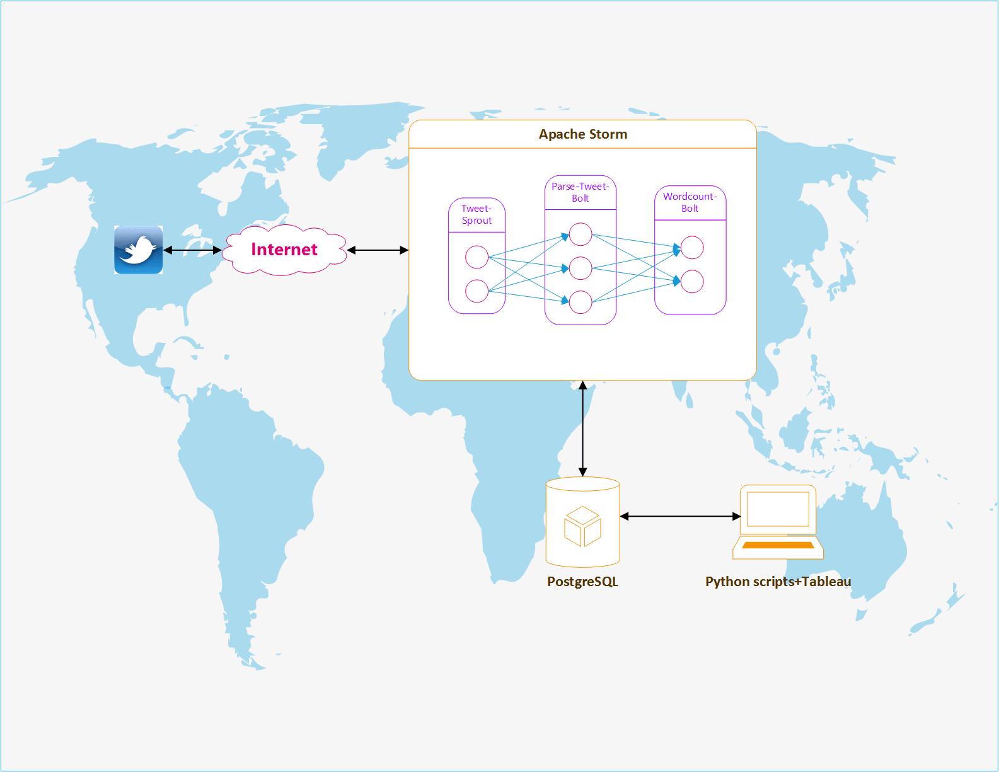
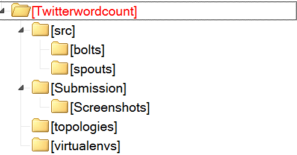
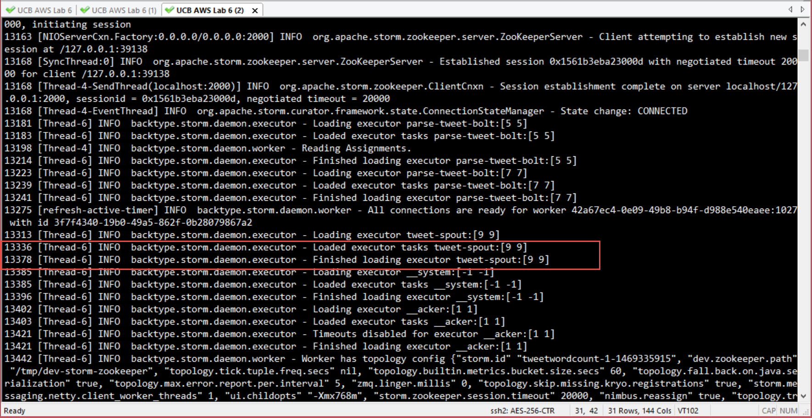
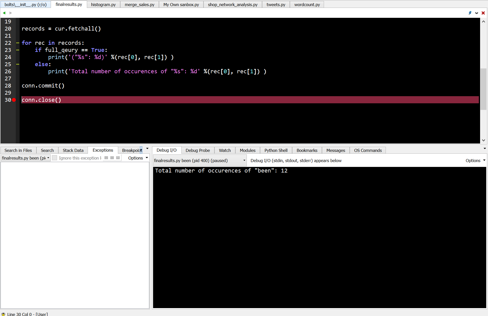
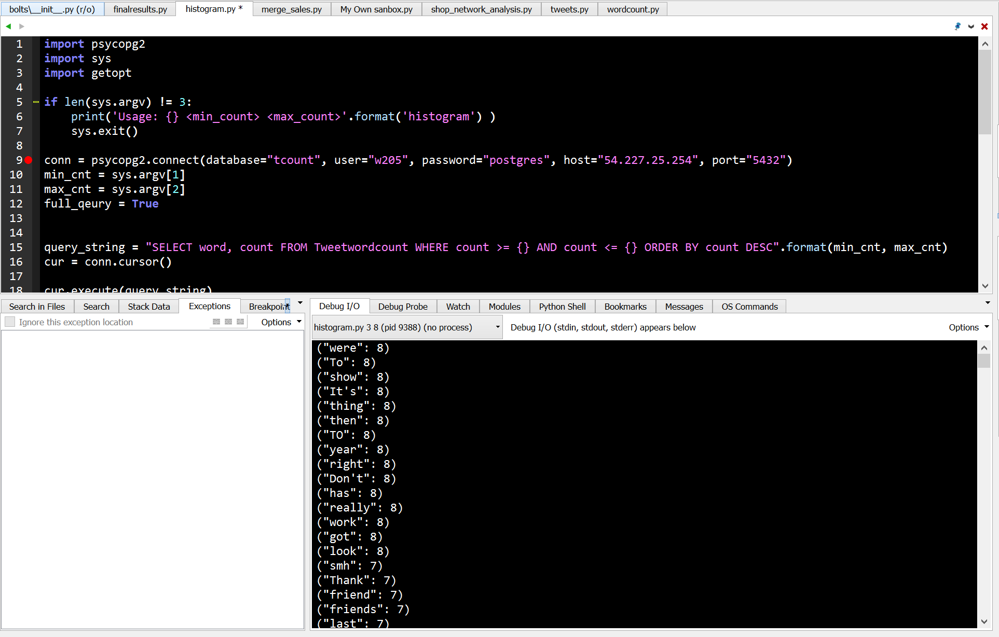
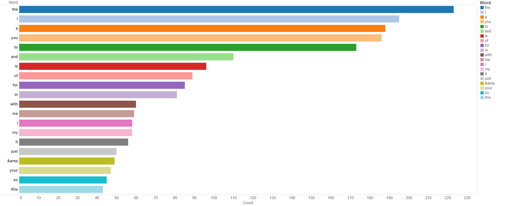

# Table of Contents
1. [Architecture](#1-architecture)
2. [Screenshots](#2-screenshots)
3. [Step-by-step Instructions](#3-step-by-step-instructions)
4. [Bar Charts Showing Top 20 Words in the Twitter Stream](#4-bar-charts-showing-top-20-words-in-the-twitter-stream)

---------------------

## 1 Architecture

#### Application Overview 

This project consists of four major modules

1. **Twitter API connection** - Twitter will be the server of data source and its APIs allow developers to track the twitter messages in real-time. Through its streaming APIs, we can filter out unwanted languages and messages .  
2. **Streamparse Framework** - By utilizing the streamparse framework, we create one sprout and two bolts. The sprout, the entry point of the data source, will interface with Twitter APIs and receive real-time twitter message streaming. The Sprout will emit twitter messages to 'ParseTweet' bolt.
In 'ParseTweet' bolt, twitter messages will be split into word list which are filtered out special characters (e.g. #!@#$%^&), and finally emitted to the next bolt 'WordCounter'
In 'WordCounter' bolt, a dictionary 'Counter' will keep track number of occurance of words. In addition, it interfaces PostgreSQL thrugh psycopg2 module to update the record in the database table.     
3. **PostgreSQL Integration** - Python psycopg2 module encapsulates PostgreSQL database access. Database connection is IP based, therefore the streamparse project and PostgreSQL server could be run in different hosts. As such, we can scale the data processing capability easily by optimizing the data processing and/or data ingestion seperately, if one of them deemed to be the bottleneck. An 'upsert' function is created in the PostgreSQL to provide the equalivant function of 'INSERT INTO ... ON DUPLICATE KEY UPDATE' of MySQL. 
The 'upsert' function will 1) insert the word as key into table if the word does not exist or 2) increase the 'count' by 1 if the word exists through 'UPDATE' SQL command. This function also performs atomic operation (UPDATE-INSERT), hence, eliminating the race conditions.   
4. **Offline Analysis** - offline analysis is performed by 1) two python scripts - finalresults.py and histogram.py and 2) Tableau. 
The two python scripts also utilize psycopg2 module to access PostgreSQL database, and retrieve data through SQL query commands. 
Tableau which connects PostgreSQL server through IP network, provides good visualization of data analysis. 

#### Architecture Diagram



#### Directories



#### Database Design

##### 1. Tweetwordcount table

```{sql}
CREATE TABLE Tweetwordcount
       (word TEXT PRIMARY KEY NOT NULL,
       count BIGINT     NOT NULL);
```    
##### 2. UPSERT Function

```{sql}
CREATE OR REPLACE FUNCTION upsert(key TEXT, data BIGINT) RETURNS VOID AS $$ 
DECLARE 
BEGIN 
    UPDATE Tweetwordcount SET count = count + data WHERE word = key; 
    IF NOT FOUND THEN 
        INSERT INTO Tweetwordcount(word,count) VALUES (key, data); 
    END IF; 
END; 
```
```{sql}
-- increase by 1
SELECT upsert('test', 1 );

-- increase by 10
SELECT upsert('test', 10 );
```

----------------------

## 2 Screenshots








-----------------------

## 3 Step-by-step Instructions

#### 3.1 Login to PostgreSQL server, Create 'Tcount' database and User 'w205'

```{bash}
[root@ip-172-31-9-113 ~]# psql --username=postgres
psql (8.4.20)
Type "help" for help.
postgres=# 

CREATE USER w205 WITH PASSWORD 'postgres';
DROP DATABASE Tcount;
CREATE DATABASE Tcount;
ALTER DATABASE Tcount OWNER TO w205;
GRANT ALL ON DATABASE Tcount TO w205;
``` 

#### 3.2 Login to PostgreSQL as w205 and Create table  

```{bash}
[root@ip-172-31-9-113 data]# psql --host=localhost --username=w205 --password --dbname=tcount
Password for user w205: 
psql (8.4.20)
Type "help" for help.

tcount=> 
CREATE TABLE Tweetwordcount
       (word TEXT PRIMARY KEY NOT NULL,
       count BIGINT     NOT NULL);
```

#### 3.3 Run the streamsparse project in AWS

```{bash}
[root@ip-172-31-9-113 Twitterwordcount]# sparse run
Running tweetwordcount topology...
Routing Python logging to /root/w205-summer-16-labs-exercises/exercise_2/Twitterwordcount/logs.
Running lein command to run local cluster:
lein run -m streamparse.commands.run/-main topologies/tweetwordcount.clj -t 0 --option 'topology.workers=2' --option 'topology.acker.executors=2' --option 'streamparse.log.path="/root/w205-summer-16-labs-exercises/exercise_2/Twitterwordcount/logs"' --option 'streamparse.log.level="debug"'
WARNING: You're currently running as root; probably by accident.
Press control-C to abort or Enter to continue as root.
Set LEIN_ROOT to disable this warning.
```

#### 3.4 Check the tweetwordcount table

```{bash}
[root@ip-172-31-9-113 data]# psql --host=localhost --username=w205 --password --dbname=tcount
Password for user w205: 
psql (8.4.20)
Type "help" for help.

tcount=> \l
                              List of databases
   Name    |  Owner   | Encoding  | Collation | Ctype |   Access privileges   
-----------+----------+-----------+-----------+-------+-----------------------
 metastore | postgres | SQL_ASCII | C         | C     | 
 postgres  | postgres | SQL_ASCII | C         | C     | 
 tcount    | w205     | SQL_ASCII | C         | C     | =Tc/w205
                                                      : w205=CTc/w205
 template0 | postgres | SQL_ASCII | C         | C     | =c/postgres
                                                      : postgres=CTc/postgres
 template1 | postgres | SQL_ASCII | C         | C     | =c/postgres
                                                      : postgres=CTc/postgres
(5 rows)

tcount=> \d
            List of relations
 Schema |      Name      | Type  | Owner 
--------+----------------+-------+-------
 public | tweetwordcount | table | w205
(1 row)


tcount=> SELECT * FROM tweetwordcount LIMIT 10;
     word      | count 
---------------+-------
 drunk         |     3
 webcam        |     1
 silenced      |     1
 ITALY         |     1
 dat           |     1
 pogba         |     1
 neighborhoods |     1
 propaganda    |     1
 couple        |     3
 Energizer     |     1
(10 rows)

tcount=> 
```

#### 3.5 Run the finalresult.py and histogram.py

##### 3.5.1 Retrieve the full list of word of twitter stream
```{bash}
python finalresults.py
```

##### 3.5.2 Retrieve the counter of specific words
```{bash}
python finalresults.py been we
> Total number of occurences of "we": 19
> Total number of occurences of "been": 12
```

##### 3.5.3 Histogram `<min_cnt>` `<max_cnt>`
```{bash}
python histogram.py 6 10
("come": 10)
("Brandy": 10)
("she": 10)
("man": 10)
("sing": 10)
("make": 10)
...
("going": 6)
("Love": 6)
("thank": 6)
("Thanks": 6)
("Next": 6)
("well": 6)
("give": 6)
("these": 6)
("posted": 6)
("it's": 6)
("place": 6)
("making": 6)
("1": 6)
("into": 6)
("they're": 6)
("crying": 6)
("didn't": 6)
("Shs": 6)
("part": 6)
("cannot": 6)
("next": 6)
("great": 6)
("birthday": 6)
("stupid": 6)
("any": 6)
```

-----------------------------

## 4 Bar Charts Showing Top 20 Words in the Twitter Stream

