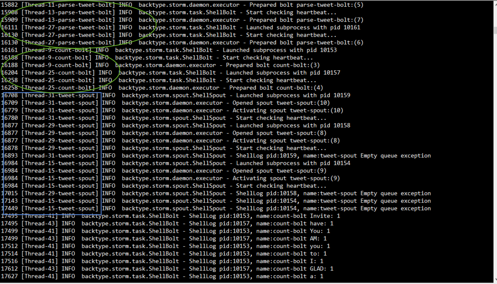

# Table of Contents
1. [Architecture](#Architecture)
2. [Screenshots](#Screenshots)
3. [Step-by-step Instructions](#Step-by-step-Instructions)
4. [Bar charts showing Top 20 words in the Twitter stream](#Bar-charts-showing-Top-20-words-in-the-Twitter-stream)

---------------------

## Architecture

----------------------

## Screenshots





-----------------------

## Step-by-step Instructions

### 1. Login to PostgreSQL Create Database and User

```{bash}
[root@ip-172-31-9-113 ~]# psql --username=postgres
psql (8.4.20)
Type "help" for help.
postgres=# 

CREATE USER w205 WITH PASSWORD 'postgres';
DROP DATABASE Tcount;
CREATE DATABASE Tcount;
ALTER DATABASE Tcount OWNER TO w205;
GRANT ALL ON DATABASE Tcount TO w205;
``` 

### 2.  Login to PostgreSQL as w205 and Create table  

```{bash}
[root@ip-172-31-9-113 data]# psql --host=localhost --username=w205 --password --dbname=tcount
Password for user w205: 
psql (8.4.20)
Type "help" for help.

tcount=> 
CREATE TABLE Tweetwordcount
       (word TEXT PRIMARY KEY NOT NULL,
       count BIGINT     NOT NULL);
```

### 3. Run the streamsparse project in AWS

```{bash}
[root@ip-172-31-9-113 Twitterwordcount]# sparse run
Running tweetwordcount topology...
Routing Python logging to /root/w205-summer-16-labs-exercises/exercise_2/Twitterwordcount/logs.
Running lein command to run local cluster:
lein run -m streamparse.commands.run/-main topologies/tweetwordcount.clj -t 0 --option 'topology.workers=2' --option 'topology.acker.executors=2' --option 'streamparse.log.path="/root/w205-summer-16-labs-exercises/exercise_2/Twitterwordcount/logs"' --option 'streamparse.log.level="debug"'
WARNING: You're currently running as root; probably by accident.
Press control-C to abort or Enter to continue as root.
Set LEIN_ROOT to disable this warning.
```

### 4. Check the tweetwordcount table

```{bash}
[root@ip-172-31-9-113 data]# psql --host=localhost --username=w205 --password --dbname=tcount
Password for user w205: 
psql (8.4.20)
Type "help" for help.

tcount=> \l
                              List of databases
   Name    |  Owner   | Encoding  | Collation | Ctype |   Access privileges   
-----------+----------+-----------+-----------+-------+-----------------------
 metastore | postgres | SQL_ASCII | C         | C     | 
 postgres  | postgres | SQL_ASCII | C         | C     | 
 tcount    | w205     | SQL_ASCII | C         | C     | =Tc/w205
                                                      : w205=CTc/w205
 template0 | postgres | SQL_ASCII | C         | C     | =c/postgres
                                                      : postgres=CTc/postgres
 template1 | postgres | SQL_ASCII | C         | C     | =c/postgres
                                                      : postgres=CTc/postgres
(5 rows)

tcount=> \d
            List of relations
 Schema |      Name      | Type  | Owner 
--------+----------------+-------+-------
 public | tweetwordcount | table | w205
(1 row)


tcount=> SELECT * FROM tweetwordcount LIMIT 10;
     word      | count 
---------------+-------
 drunk         |     3
 webcam        |     1
 silenced      |     1
 ITALY         |     1
 dat           |     1
 pogba         |     1
 neighborhoods |     1
 propaganda    |     1
 couple        |     3
 Energizer     |     1
(10 rows)

tcount=> 
```

### 5. Run the finalresult.py and histogram.py

#### Retrieve the full list of word of twitter stream
```{bash}
python finalresults.py
```

#### Retrieve the counter of specific words
```{bash}
python finalresults.py been we
> Total number of occurences of "we": 19
> Total number of occurences of "been": 12
```

### Histogram `<min_cnt>` `<max_cnt>`
```{bash}
hstogram.py 6 10
("come": 10)
("Brandy": 10)
("she": 10)
("man": 10)
("sing": 10)
("make": 10)
("I've": 10)
("last": 10)
("everything": 10)
("even": 10)
("years": 10)
("say": 9)
("I'll": 9)
("better": 9)
("It's": 9)
("only": 9)
("happy": 9)
("look": 9)
("real": 9)
("an": 9)
("ALL": 9)
("person": 9)
("he's": 9)
("friends": 9)
("enough": 9)
("ur": 9)
("TO": 9)
("IS": 9)
("you're": 9)
("If": 9)
("liked": 9)
("This": 9)
("One": 9)
("many": 8)
("via": 8)
("us": 8)
("had": 8)
("keep": 8)
("take": 8)
("every": 8)
("Just": 8)
("really": 8)
("text": 8)
("find": 8)
("ever": 8)
("sure": 8)
("best": 8)
("meet": 8)
("end": 8)
("4": 7)
("done": 7)
("kill": 7)
("being": 7)
("And": 7)
("5": 7)
("shit": 7)
("baby": 7)
("very": 7)
("wanna": 7)
("during": 7)
("others": 7)
("used": 7)
("thing": 7)
("6": 7)
("Thank": 7)
("did": 7)
("different": 7)
("said": 7)
("miss": 6)
("doesn't": 6)
("email": 6)
("tweets": 6)
("true": 6)
("dog": 6)
("heart": 6)
("MY": 6)
("talk": 6)
("same": 6)
("photo": 6)
("guys": 6)
("So": 6)
("should": 6)
("going": 6)
("Love": 6)
("thank": 6)
("Thanks": 6)
("Next": 6)
("well": 6)
("give": 6)
("these": 6)
("posted": 6)
("it's": 6)
("place": 6)
("making": 6)
("1": 6)
("into": 6)
("they're": 6)
("crying": 6)
("didn't": 6)
("Shs": 6)
("part": 6)
("cannot": 6)
("next": 6)
("great": 6)
("birthday": 6)
("stupid": 6)
("any": 6)
```

-----------------------------

## Bar charts showing Top 20 words in the Twitter stream

