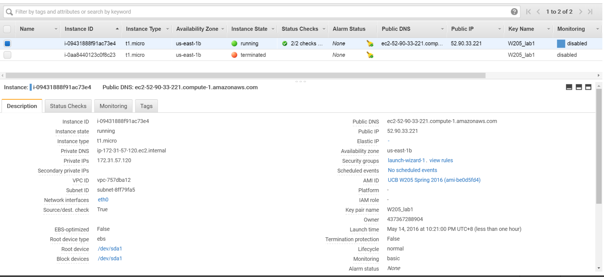

## Provide a screenshot of the running UCB AMI that shows you have successfully launched an EC2 instance using the UCB AMI.



## Provide the answers to the following questions in a file called Lab1-answers.txt
### Q1: What is the difference between EBS and S3?

**Cost**
* S3: $0.03/Month
* EBS: $0.05-0.1/Month

**EBS** is:

* A block storage (so you need to format it). This means you are able to choose which type of file system you want.
* As it's a block storage, you can use Raid 1 (or 0 or 10) with multiple block storages
* It is really fast
* It is relatively cheap
* With the new announcements from Amazon, you can store up to 16TB data per storage on SSD-s.
* You can snapshot an EBS (while it's still running) for backup reasons
* But it only exists in a particular region. Although you can migrate it to another region, you cannot just access it across regions (only if you share it via the EC2; but that means you have a file server)
* You need an EC2 instance to attach it to

**S3** is:

* An object store (not a file system).
* You can store files and "folders" but can't have locks, permissions etc like you would with a traditional file system
* This means, by default you can't just mount S3 and use it as your webserver
* But it's perfect for storing your images and videos for your website
* Great for short term archiving (e.g. a few weeks). It's good for long term archiving too, but Glacier is more cost efficient.
* Great for storing logs
* You can access the data from every region (extra costs may apply)
* Higly Available, Redundant. Basically data loss is not possible (99.999999999% durability, 99.9 uptime SLA)
* Much cheaper than EBS.
* You can serve the content directly to the internet, you can even have a full (static) website working direct from S3, without an EC2 instance

Source: [http://stackoverflow.com/questions/29575877/aws-efs-vs-ebs-vs-s3-differences-when-to-use][1]

[1]: http://stackoverflow.com/questions/29575877/aws-efs-vs-ebs-vs-s3-differences-when-to-use

### Q2: When would you consider a cloud infrastructure for your data science tasks?

Few factors to consider

* Quick setup: We can create instances very quickly. AWS offers veraious AMIs which provide platforms for data analytic tasks so that we can concentrate on building data analytics module instead of setup servers..  
* Upfront Cost : some server software could be costly (e.g. Tableau server) when buying up-front. AWS provides hourly pricing plan so that companies can quickly scale the capacity they need while minimize the investment.
* Stability: AWS has dedicated technical team to maintain 24x7 service. If we were maintain the same SLA inhouse, dedicated IT would be hired.
* Scalibility: When the data analytic task requires high computing capability, cloud service is the number one choice. We can scale the server farm quickly to meet the demand of computation power.    

### Q3: What is the difference between spot instances and reserved instances?

AWS offers 3 pricing types:

* **Reserved Instances** - (low cost, high reliability, but pay up-front) Use these for cost savings on long running / constant / predictable workloads
* **On-demand instances** - (highest cost, high reliability, but pay as you go) Use these for temporary workloads e.g. development / proof of concept / unpredictable workloads that can't be interrupted.
* **Spot Instances** - (generally lowest cost, but can terminate unexpectedly) Use these for workloads that can pause and resume, but are not mission critical. Ensure applications are designed with this in mind (e.g. maintain state somewhere permanent and support the ability for new instances to resume where previous ones left off).

 
### Q4: List the names of four software packages installed on the UCB AMI

```bash

Last login: Sat May 14 14:30:11 2016 from 199.195.193.151
     ___   _        __   __   ____            __    
    / _ \ (_)___ _ / /  / /_ / __/____ ___ _ / /___ 
   / , _// // _ `// _ \/ __/_\ \ / __// _ `// // -_)
  /_/|_|/_/ \_, //_//_/\__//___/ \__/ \_,_//_/ \__/ 
           /___/                                                 
                                              
Welcome to a virtual machine image brought to you by RightScale!

[root@ip-172-31-57-120 ~]# rpm -qa
hadoop-2.6.0+cdh5.4.5+626-1.cdh5.4.5.p0.8.el6.x86_64
iputils-20071127-17.el6_4.2.x86_64
setup-2.8.14-20.el6_4.1.noarch
hadoop-mapreduce-historyserver-2.6.0+cdh5.4.5+626-1.cdh5.4.5.p0.8.el6.x86_64
kbd-1.15-11.el6.x86_64
centos-release-6-6.el6.centos.12.2.x86_64
hadoop-0.20-mapreduce-2.6.0+cdh5.4.5+626-1.cdh5.4.5.p0.8.el6.x86_64
pm-utils-1.2.5-11.el6.x86_64
ncurses-base-5.7-3.20090208.el6.x86_64
hadoop-client-2.6.0+cdh5.4.5+626-1.cdh5.4.5.p0.8.el6.x86_64
crda-1.1.3_2014.06.13-1.el6.x86_64
ncurses-libs-5.7-3.20090208.el6.x86_64
postgresql-8.4.20-3.el6_6.x86_64
p11-kit-trust-0.18.5-2.el6_5.2.x86_64
zlib-1.2.3-29.el6.x86_64
postgresql-test-8.4.20-3.el6_6.x86_64
MAKEDEV-3.24-6.el6.x86_64
chkconfig-1.3.49.3-2.el6_4.1.x86_64
postgresql-contrib-8.4.20-3.el6_6.x86_64
coreutils-libs-8.4-37.el6.x86_64
nss-util-3.16.2.3-2.el6_6.x86_64
nss-3.16.2.3-3.el6_6.x86_64
shadow-utils-4.1.4.2-19.el6.x86_64
python-2.6.6-52.el6.x86_64
db4-4.7.25-18.el6_4.x86_64
man-1.6f-32.el6.x86_64
readline-6.0-4.el6.x86_64
abrt-libs-2.0.8-26.el6.centos.x86_64
xmlrpc-c-1.16.24-1210.1840.el6.x86_64
ssmtp-2.61-22.el6.x86_64
libidn-1.18-2.el6.x86_64
udev-147-2.57.el6.x86_64
libudev-147-2.57.el6.x86_64
libdrm-2.4.52-4.el6.x86_64
bzip2-1.0.5-7.el6_0.x86_64
iptables-ipv6-1.4.7-14.el6.x86_64
pciutils-libs-3.1.10-4.el6.x86_64
blktrace-1.0.1-6.el6.x86_64
nss-softokn-3.14.3-22.el6_6.x86_64
openssh-clients-5.3p1-104.el6_6.1.x86_64
pcre-7.8-6.el6.x86_64
cpuspeed-1.5-20.el6_4.x86_64
procps-3.2.8-30.el6.x86_64
vim-enhanced-7.2.411-1.8.el6.x86_64
libedit-2.11-4.20080712cvs.1.el6.x86_64
fprintd-pam-0.1-21.git04fd09cfa.el6.x86_64
perl-Pod-Escapes-1.04-136.el6_6.1.x86_64
tcsh-6.17-25.el6_6.x86_64
perl-libs-5.10.1-136.el6_6.1.x86_64
rsync-3.0.6-12.el6.x86_64
p11-kit-0.18.5-2.el6_5.2.x86_64
eject-2.1.5-17.el6.x86_64
shared-mime-info-0.70-6.el6.x86_64
setserial-2.17-25.el6.x86_64
tcp_wrappers-7.6-57.el6.x86_64
gpg-pubkey-9a917d05-4ee7084e
hal-libs-0.5.14-14.el6.x86_64
libxslt-1.1.26-2.el6_3.1.x86_64
upstart-0.6.5-13.el6_5.3.x86_64
gdbm-devel-1.8.0-36.el6.x86_64
module-init-tools-3.9-24.el6.x86_64
kernel-headers-2.6.32-504.12.2.el6.centos.plus.x86_64
libxcb-1.9.1-2.el6.x86_64
perl-devel-5.10.1-136.el6_6.1.x86_64
rpm-4.8.0-38.el6_6.x86_64
pax-3.4-10.1.el6.x86_64
sos-2.2-68.el6.centos.noarch
libyaml-0.1.3-4.el6_6.x86_64
libreport-plugin-logger-2.0.9-21.el6.centos.x86_64
epel-release-6-8.noarch
sgpio-1.2.0.10-5.el6.x86_64
libSM-1.2.1-2.el6.x86_64
usermode-1.102-3.el6.x86_64
libXmu-1.1.1-2.el6.x86_64
wireless-tools-29-5.1.1.el6.x86_64
libotf-0.9.9-3.1.el6.x86_64
filesystem-2.4.30-3.el6.x86_64
libXcursor-1.1.14-2.1.el6.x86_64
nss-softokn-freebl-3.14.3-22.el6_6.x86_64
libXrandr-1.4.1-2.1.el6.x86_64
info-4.13a-8.el6.x86_64
gnutls-2.8.5-14.el6_5.x86_64
libxml2-2.7.6-17.el6_6.1.x86_64
cups-libs-1.4.2-67.el6.x86_64
bzip2-libs-1.0.5-7.el6_0.x86_64
GConf2-2.28.0-6.el6.x86_64
libuuid-2.17.2-12.18.el6.x86_64
perl-Error-0.17015-4.el6.noarch
libgcrypt-1.4.5-11.el6_4.x86_64
blas-3.2.1-4.el6.x86_64
libcap-ng-0.6.4-3.el6_0.1.x86_64
ppl-0.10.2-11.el6.x86_64
grep-2.6.3-6.el6.x86_64
blas-devel-3.2.1-4.el6.x86_64
libusb1-1.0.9-0.6.rc1.el6.x86_64
libstdc++-devel-4.4.7-11.el6.x86_64
system-config-firewall-base-1.2.27-7.2.el6_6.noarch
libaio-0.3.107-10.el6.x86_64
jpackage-utils-1.7.5-3.12.el6.noarch
system-config-network-tui-1.6.0.el6.2-1.el6.noarch
java-1.8.0-openjdk-headless-1.8.0.45-28.b13.el6_6.x86_64
ntsysv-1.3.49.3-2.el6_4.1.x86_64
compat-readline5-5.2-17.1.el6.x86_64
irqbalance-1.0.4-10.el6.x86_64
xorg-x11-fonts-Type1-7.2-9.1.el6.noarch
mdadm-3.3-6.el6_6.1.x86_64
rng-tools-2-13.el6_2.x86_64
postgresql-odbc-08.04.0200-1.el6.x86_64
smartmontools-5.43-1.el6.x86_64
ledmon-0.79-1.el6.x86_64
abrt-cli-2.0.8-26.el6.centos.x86_64
postgres-xl92-debuginfo-9.2-34.1.x86_64
alsa-utils-1.0.22-9.el6_6.x86_64
postgres-xl92-server-9.2-34.1.x86_64
at-3.1.10-44.el6_6.2.x86_64
gpg-pubkey-e8f86acd-4a418045
hunspell-en-0.20090216-7.1.el6.noarch
bigtop-jsvc-0.6.0+cdh5.4.0+677-1.cdh5.4.0.p0.46.el6.x86_64
bc-1.06.95-1.el6.x86_64
ed-1.1-3.3.el6.x86_64
mtr-0.75-5.el6.x86_64
strace-4.5.19-1.19.el6.x86_64
zookeeper_2_2_4_2_2-3.4.6.2.2.4.2-2.el6.noarch
vconfig-1.9-8.1.el6.x86_64
freetype-2.3.11-15.el6_6.1.x86_64
centos-indexhtml-6-2.el6.centos.noarch
sentry-1.4.0+cdh5.4.0+155-1.cdh5.4.0.p0.47.el6.noarch
dhcp-common-4.1.1-43.P1.el6.centos.1.x86_64
dhclient-4.1.1-43.P1.el6.centos.1.x86_64
fontconfig-2.8.0-5.el6.x86_64
libXrender-0.9.8-2.1.el6.x86_64
libXft-2.3.1-2.el6.x86_64
pixman-0.32.4-4.el6.x86_64
cairo-1.8.8-3.1.el6.x86_64
libthai-0.1.12-3.el6.x86_64
pango-1.28.1-10.el6.x86_64
yajl-1.0.7-3.el6.x86_64
collectd-4.10.9-1.el6.x86_64
fontpackages-filesystem-1.41-1.1.el6.noarch
dejavu-fonts-common-2.30-2.el6.noarch
dejavu-lgc-sans-mono-fonts-2.30-2.el6.noarch
dejavu-sans-mono-fonts-2.30-2.el6.noarch
rrdtool-1.3.8-7.el6.x86_64
collectd-rrdtool-4.10.9-1.el6.x86_64
rightimage-extras-base-14.0-2.el6.noarch
desktop-file-utils-0.15-9.el6.x86_64
libtiff-3.9.4-10.el6_5.x86_64
elfutils-0.158-3.2.el6.x86_64
e2fsprogs-1.41.12-21.el6.x86_64
iw-3.10-1.1.el6.x86_64
pinentry-0.7.6-6.el6.x86_64
libss-1.41.12-21.el6.x86_64
dash-0.5.5.1-4.el6.x86_64
libutempter-1.1.5-4.1.el6.x86_64
coreutils-8.4-37.el6.x86_64
acl-2.2.49-6.el6.x86_64
ConsoleKit-0.4.1-3.el6.x86_64
diffutils-2.8.1-28.el6.x86_64
redhat-logos-60.0.14-12.el6.centos.noarch
vim-common-7.2.411-1.8.el6.x86_64
libffi-3.0.5-3.2.el6.x86_64
less-436-13.el6.x86_64
rpm-libs-4.8.0-38.el6_6.x86_64
cracklib-dicts-2.8.16-4.el6.x86_64
passwd-0.77-4.el6_2.2.x86_64
hwdata-0.233-11.1.el6.noarch
python-ethtool-0.6-5.el6.x86_64
ConsoleKit-libs-0.4.1-3.el6.x86_64
libreport-plugin-rhtsupport-2.0.9-21.el6.centos.x86_64
logrotate-3.7.8-17.el6.x86_64
abrt-addon-ccpp-2.0.8-26.el6.centos.x86_64
alsa-lib-1.0.22-3.el6.x86_64
yum-3.2.29-60.el6.centos.noarch
libX11-1.6.0-2.2.el6.x86_64
numactl-2.0.9-2.el6.x86_64
mingetty-1.08-5.el6.x86_64
iproute-2.6.32-33.el6_6.x86_64
openssl-1.0.1e-30.el6_6.5.x86_64
device-mapper-event-1.02.90-2.el6_6.1.x86_64
libcurl-7.19.7-40.el6_6.4.x86_64
cryptsetup-luks-1.2.0-11.el6.x86_64
openldap-2.4.39-8.el6.x86_64
kernel-2.6.32-504.12.2.el6.centos.plus.x86_64
mailx-12.4-8.el6_6.x86_64
cronie-anacron-1.4.4-12.el6.x86_64
pygpgme-0.1-18.20090824bzr68.el6.x86_64
slang-2.2.1-1.el6.x86_64
yum-metadata-parser-1.1.2-16.el6.x86_64
libpcap-1.4.0-1.20130826git2dbcaa1.el6.x86_64
dbus-python-0.83.0-6.1.el6.x86_64
system-config-firewall-tui-1.2.27-7.2.el6_6.noarch
libreport-plugin-reportuploader-2.0.9-21.el6.centos.x86_64
sysstat-9.0.4-27.el6.x86_64
libreport-2.0.9-21.el6.centos.x86_64
pcmciautils-015-4.2.el6.x86_64
abrt-addon-python-2.0.8-26.el6.centos.x86_64
biosdevname-0.5.1-1.el6.x86_64
libreport-cli-2.0.9-21.el6.centos.x86_64
readahead-1.5.6-2.el6.x86_64
yum-plugin-fastestmirror-1.1.30-30.el6.noarch
virt-what-1.11-1.2.el6.x86_64
fipscheck-1.2.0-7.el6.x86_64
bind-utils-9.8.2-0.30.rc1.el6_6.2.x86_64
plymouth-core-libs-0.8.3-27.el6.centos.1.x86_64
man-pages-overrides-6.6.3-2.el6.noarch
gpm-libs-1.20.6-12.el6.x86_64
systemtap-runtime-2.5-5.el6.x86_64
iptables-1.4.7-14.el6.x86_64
pam_passwdqc-1.0.5-6.el6.x86_64
initscripts-9.03.46-1.el6.centos.1.x86_64
tmpwatch-2.9.16-4.el6.x86_64
device-mapper-event-libs-1.02.90-2.el6_6.1.x86_64
unzip-6.0-1.el6.x86_64
lvm2-libs-2.02.111-2.el6_6.1.x86_64
nano-2.0.9-7.el6.x86_64
cryptsetup-luks-libs-1.2.0-11.el6.x86_64
dosfstools-3.0.9-4.el6.x86_64
hal-0.5.14-14.el6.x86_64
rfkill-0.3-4.el6.x86_64
dracut-kernel-004-356.el6_6.1.noarch
traceroute-2.0.14-2.el6.x86_64
python-iwlib-0.1-1.2.el6.x86_64
words-3.0-17.el6.noarch
crontabs-1.10-33.el6.noarch
grub-0.97-93.el6.x86_64
xz-lzma-compat-4.999.9-0.5.beta.20091007git.el6.x86_64
vim-minimal-7.2.411-1.8.el6.x86_64
db4-utils-4.7.25-18.el6_4.x86_64
cvs-1.11.23-16.el6.x86_64
checkpolicy-2.0.22-1.el6.x86_64
libarchive-2.8.3-4.el6_2.x86_64
libpng-1.2.49-1.el6_2.x86_64
db4-devel-4.7.25-18.el6_4.x86_64
cracklib-2.8.16-4.el6.x86_64
perl-CGI-3.51-136.el6_6.1.x86_64
pciutils-3.1.10-4.el6.x86_64
gettext-0.17-18.el6.x86_64
nss-tools-3.16.2.3-3.el6_6.x86_64
glibc-headers-2.12-1.149.el6_6.5.x86_64
fprintd-0.1-21.git04fd09cfa.el6.x86_64
perl-ExtUtils-ParseXS-2.2003.0-136.el6_6.1.x86_64
libssh2-1.4.2-1.el6_6.1.x86_64
perl-Test-Harness-3.17-136.el6_6.1.x86_64
libuser-0.56.13-5.el6.x86_64
perl-Test-Simple-0.92-136.el6_6.1.x86_64
python-urlgrabber-3.9.1-9.el6.noarch
patch-2.6-6.el6.x86_64
libproxy-python-0.3.0-10.el6.x86_64
redhat-lsb-core-4.0-7.el6.centos.x86_64
abrt-2.0.8-26.el6.centos.x86_64
rightlink6-sandbox-6.3.3-0.x86_64
python-iniparse-0.3.1-2.1.el6.noarch
rightlink6-6.3.3-0.x86_64
ethtool-3.5-5.el6.x86_64
yum-plugin-priorities-1.1.30-30.el6.noarch
policycoreutils-2.0.83-19.47.el6_6.1.x86_64
device-mapper-1.02.90-2.el6_6.1.x86_64
dmraid-1.0.0.rc16-11.el6.x86_64
dracut-004-356.el6_6.1.noarch
rsyslog-5.8.10-10.el6_6.x86_64
libgcc-4.4.7-11.el6.x86_64
libX11-common-1.6.0-2.2.el6.noarch
kbd-misc-1.15-11.el6.noarch
glibc-2.12-1.149.el6_6.5.x86_64
libcap-2.16-5.5.el6.x86_64
popt-1.13-7.el6.x86_64
audit-libs-2.3.7-5.el6.x86_64
libselinux-2.0.94-5.8.el6.x86_64
sed-4.2.1-10.el6.x86_64
gawk-3.1.7-10.el6.x86_64
xz-libs-4.999.9-0.5.beta.20091007git.el6.x86_64
findutils-4.4.2-6.el6.x86_64
libnl-1.1.4-2.el6.x86_64
lua-5.1.4-4.1.el6.x86_64
cpio-2.10-12.el6_5.x86_64
libjpeg-turbo-1.2.1-3.el6_5.x86_64
cyrus-sasl-lib-2.1.23-15.el6_6.1.x86_64
psmisc-22.6-19.el6_5.x86_64
libtar-1.2.11-17.el6_4.1.x86_64
gdbm-1.8.0-36.el6.x86_64
perl-version-0.77-136.el6_6.1.x86_64
perl-Module-Pluggable-3.90-136.el6_6.1.x86_64
perl-5.10.1-136.el6_6.1.x86_64
libtasn1-2.3-6.el6_5.x86_64
pkgconfig-0.23-9.1.el6.x86_64
glib2-2.28.8-4.el6.x86_64
dbus-glib-0.86-6.el6.x86_64
sysvinit-tools-2.87-5.dsf.el6.x86_64
eggdbus-0.6-3.el6.x86_64
ca-certificates-2014.1.98-65.1.el6.noarch
jasper-libs-1.900.1-16.el6_6.3.x86_64
device-mapper-persistent-data-0.3.2-1.el6.x86_64
hunspell-1.2.8-16.el6.x86_64
net-tools-1.60-110.el6_2.x86_64
libnih-1.0.1-7.el6.x86_64
make-3.81-20.el6.x86_64
ncurses-5.7-3.20090208.el6.x86_64
gzip-1.3.12-22.el6.x86_64
pam-1.1.1-20.el6.x86_64
libpciaccess-0.13.3-0.1.el6.x86_64
polkit-0.96-7.el6.x86_64
nss-sysinit-3.16.2.3-3.el6_6.x86_64
libXau-1.0.6-4.el6.x86_64
libfprint-0.1.0-19.pre2.el6.x86_64
keyutils-libs-1.4-5.el6.x86_64
python-libs-2.6.6-52.el6.x86_64
curl-7.19.7-40.el6_6.4.x86_64
rpm-python-4.8.0-38.el6_6.x86_64
gnupg2-2.0.14-8.el6.x86_64
python-pycurl-7.19.0-8.el6.x86_64
libxml2-python-2.7.6-17.el6_6.1.x86_64
libproxy-0.3.0-10.el6.x86_64
libreport-python-2.0.9-21.el6.centos.x86_64
libreport-plugin-mailx-2.0.9-21.el6.centos.x86_64
abrt-tui-2.0.8-26.el6.centos.x86_64
abrt-addon-kerneloops-2.0.8-26.el6.centos.x86_64
bind-libs-9.8.2-0.30.rc1.el6_6.2.x86_64
sg3_utils-libs-1.28-6.el6.x86_64
libpng-devel-1.2.49-1.el6_2.x86_64
hdparm-9.43-4.el6.x86_64
hadoop-hdfs-2.6.0+cdh5.4.5+626-1.cdh5.4.5.p0.8.el6.x86_64
hadoop-mapreduce-2.6.0+cdh5.4.5+626-1.cdh5.4.5.p0.8.el6.x86_64
hadoop-yarn-nodemanager-2.6.0+cdh5.4.5+626-1.cdh5.4.5.p0.8.el6.x86_64
hadoop-hdfs-secondarynamenode-2.6.0+cdh5.4.5+626-1.cdh5.4.5.p0.8.el6.x86_64
hadoop-hdfs-datanode-2.6.0+cdh5.4.5+626-1.cdh5.4.5.p0.8.el6.x86_64
hadoop-conf-pseudo-2.6.0+cdh5.4.5+626-1.cdh5.4.5.p0.8.el6.x86_64
hive-jdbc-1.1.0+cdh5.4.5+199-1.cdh5.4.5.p0.8.el6.noarch
postgresql-libs-8.4.20-3.el6_6.x86_64
postgresql-server-8.4.20-3.el6_6.x86_64
postgresql-plperl-8.4.20-3.el6_6.x86_64
postgresql-pltcl-8.4.20-3.el6_6.x86_64
postgresql-devel-8.4.20-3.el6_6.x86_64
python27-libs-2.7.3-19.ius.el6.x86_64
libICE-1.0.6-1.el6.x86_64
libXt-1.1.4-6.1.el6.x86_64
libXfixes-5.0.1-2.1.el6.x86_64
m17n-db-1.5.5-1.1.el6.noarch
libXaw-1.0.11-2.el6.x86_64
m17n-lib-1.5.5-2.el6_1.1.x86_64
libXdamage-1.1.3-4.el6.x86_64
giflib-4.1.6-3.1.el6.x86_64
libXinerama-1.1.3-2.1.el6.x86_64
libXcomposite-0.4.3-4.el6.x86_64
emacs-common-23.1-25.el6.x86_64
libIDL-0.8.13-2.1.el6.x86_64
avahi-libs-0.6.25-15.el6.x86_64
hicolor-icon-theme-0.11-1.1.el6.noarch
sgml-common-0.6.3-33.el6.noarch
libgsf-1.14.15-5.el6.x86_64
emacs-23.1-25.el6.x86_64
perl-Git-1.7.1-3.el6_4.1.noarch
libgfortran-4.4.7-11.el6.x86_64
lapack-3.2.1-4.el6.x86_64
cpp-4.4.7-11.el6.x86_64
cloog-ppl-0.15.7-1.2.el6.x86_64
gcc-gfortran-4.4.7-11.el6.x86_64
lapack-devel-3.2.1-4.el6.x86_64
python-devel-2.6.6-52.el6.x86_64
gcc-c++-4.4.7-11.el6.x86_64
libfontenc-1.0.5-2.el6.x86_64
libXfont-1.4.5-4.el6_6.x86_64
tzdata-java-2015d-1.el6.noarch
libtool-ltdl-2.2.6-15.5.el6.x86_64
libXtst-1.2.2-2.1.el6.x86_64
ruby-libs-1.8.7.374-4.el6_6.x86_64
ttmkfdir-3.0.9-32.1.el6.x86_64
java-1.8.0-openjdk-1.8.0.45-28.b13.el6_6.x86_64
tcl-8.5.7-6.el6.x86_64
postgresql-plruby-doc-0.5.3-4.el6.x86_64
postgresql-pgpool-II-devel-3.2.0-1.el6.x86_64
postgres-xl92-libs-9.2-34.1.x86_64
postgres-xl92-contrib-9.2-34.1.x86_64
postgres-xl92-devel-9.2-34.1.x86_64
postgres-xl92-gtm-9.2-34.1.x86_64
postgres-xl92-plperl-9.2-34.1.x86_64
postgres-xl92-pltcl-9.2-34.1.x86_64
avro-libs-1.7.6+cdh5.4.0+87-1.cdh5.4.0.p0.46.el6.noarch
zookeeper-3.4.5+cdh5.4.0+84-1.cdh5.4.0.p0.46.el6.x86_64
nc-1.84-22.el6.x86_64
parquet-1.5.0+cdh5.4.0+92-1.cdh5.4.0.p0.48.el6.noarch
hdp-select-2.2.4.2-2.el6.noarch
ranger_2_2_4_2_2-storm-plugin-0.4.0.2.2.4.2-2.el6.x86_64
storm-0.9.3.2.2.4.2-2.el6.noarch
zlib-devel-1.2.3-29.el6.x86_64
libsemanage-2.0.43-4.2.el6.x86_64
gpg-pubkey-0608b895-4bd22942
hadoop-yarn-2.6.0+cdh5.4.5+626-1.cdh5.4.5.p0.8.el6.x86_64
device-mapper-libs-1.02.90-2.el6_6.1.x86_64
basesystem-10.0-4.el6.noarch
hadoop-yarn-resourcemanager-2.6.0+cdh5.4.5+626-1.cdh5.4.5.p0.8.el6.x86_64
dmraid-events-1.0.0.rc16-11.el6.x86_64
kernel-firmware-2.6.32-504.12.2.el6.centos.plus.noarch
hadoop-hdfs-namenode-2.6.0+cdh5.4.5+626-1.cdh5.4.5.p0.8.el6.x86_64
plymouth-0.8.3-27.el6.centos.1.x86_64
glibc-common-2.12-1.149.el6_6.5.x86_64
hive-1.1.0+cdh5.4.5+199-1.cdh5.4.5.p0.8.el6.noarch
ntpdate-4.2.6p5-3.el6.centos.x86_64
libattr-2.4.44-7.el6.x86_64
postgresql-plpython-8.4.20-3.el6_6.x86_64
file-5.04-21.el6.x86_64
dbus-libs-1.2.24-7.el6_3.x86_64
postgresql-docs-8.4.20-3.el6_6.x86_64
binutils-2.20.51.0.2-5.42.el6.x86_64
libacl-2.2.49-6.el6.x86_64
python27-2.7.3-19.ius.el6.x86_64
plymouth-scripts-0.8.3-27.el6.centos.1.x86_64
libsepol-2.0.41-4.el6.x86_64
gdk-pixbuf2-2.24.1-5.el6.x86_64
libcom_err-1.41.12-21.el6.x86_64
xmlrpc-c-client-1.16.24-1210.1840.el6.x86_64
elfutils-libelf-0.158-3.2.el6.x86_64
libproxy-bin-0.3.0-10.el6.x86_64
btparser-0.17-2.el6.x86_64
libreport-plugin-kerneloops-2.0.9-21.el6.centos.x86_64
libblkid-2.17.2-12.18.el6.x86_64
ustr-1.0.4-9.1.el6.x86_64
libgpg-error-1.7-4.el6.x86_64
kpartx-0.4.9-80.el6_6.3.x86_64
sqlite-3.6.20-1.el6.x86_64
openssh-5.3p1-104.el6_6.1.x86_64
which-2.19-6.el6.x86_64
newt-python-0.52.11-3.el6.x86_64
dbus-1.2.24-7.el6_3.x86_64
setuptool-1.19.9-4.el6.x86_64
xz-4.999.9-0.5.beta.20091007git.el6.x86_64
parted-2.1-25.el6.x86_64
libusb-0.1.12-23.el6.x86_64
quota-3.17-21.el6_5.x86_64
tar-1.23-11.el6.x86_64
yum-plugin-security-1.1.30-30.el6.noarch
dmidecode-2.12-5.el6_5.x86_64
usbutils-003-4.el6.x86_64
perl-Pod-Simple-3.13-136.el6_6.1.x86_64
cyrus-sasl-plain-2.1.23-15.el6_6.1.x86_64
pth-2.0.7-9.3.el6.x86_64
scl-utils-20120927-23.el6_6.x86_64
gamin-0.1.10-9.el6.x86_64
rdate-1.4-16.el6.x86_64
tcp_wrappers-libs-7.6-57.el6.x86_64
openssh-server-5.3p1-104.el6_6.1.x86_64
grubby-7.0.15-7.el6.x86_64
sudo-1.8.6p3-15.el6.x86_64
gmp-4.3.1-7.el6_2.2.x86_64
db4-cxx-4.7.25-18.el6_4.x86_64
groff-1.18.1.4-21.el6.x86_64
libgomp-4.4.7-11.el6.x86_64
xdg-utils-1.0.2-17.20091016cvs.el6.noarch
glibc-devel-2.12-1.149.el6_6.5.x86_64
krb5-libs-1.10.3-33.el6.x86_64
perl-ExtUtils-MakeMaker-6.55-136.el6_6.1.x86_64
gpgme-1.1.8-3.el6.x86_64
m4-1.4.13-5.el6.x86_64
libreport-compat-2.0.9-21.el6.centos.x86_64
rightlink6-cloud-ec2-6.3.3-0.noarch
fipscheck-lib-1.2.0-7.el6.x86_64
libXext-1.3.2-2.1.el6.x86_64
util-linux-ng-2.17.2-12.18.el6.x86_64
atk-1.30.0-1.el6.x86_64
hal-info-20090716-3.1.el6.noarch
libXpm-3.5.10-2.el6.x86_64
gpg-pubkey-c105b9de-4e0fd3a3
m17n-db-datafiles-1.5.5-1.1.el6.noarch
tzdata-2015a-1.el6.noarch
libXi-1.7.2-2.2.el6.x86_64
bash-4.1.2-29.el6.x86_64
libcroco-0.6.2-5.el6.x86_64
nspr-4.10.6-1.el6_5.x86_64
ORBit2-2.14.17-5.el6.x86_64
libstdc++-4.4.7-11.el6.x86_64
gtk2-2.24.23-6.el6.x86_64
expat-2.0.1-11.el6_2.x86_64
librsvg2-2.26.0-14.el6.x86_64
file-libs-5.04-21.el6.x86_64
git-1.7.1-3.el6_4.1.x86_64
e2fsprogs-libs-1.41.12-21.el6.x86_64
mpfr-2.4.1-6.el6.x86_64
elfutils-libs-0.158-3.2.el6.x86_64
gcc-4.4.7-11.el6.x86_64
libselinux-utils-2.0.94-5.8.el6.x86_64
atlas-3.8.4-2.el6.x86_64
cronie-1.4.4-12.el6.x86_64
gpg-pubkey-07513cad-4fe4cf94
newt-0.52.11-3.el6.x86_64
postgresql-pgpool-II-3.2.0-1.el6.x86_64
tcpdump-4.0.0-3.20090921gitdf3cb4.2.el6.x86_64
xorg-x11-font-utils-7.2-11.el6.x86_64
authconfig-6.1.12-19.el6.x86_64
unixODBC-2.2.14-14.el6.x86_64
ntp-4.2.6p5-3.el6.centos.x86_64
postgresql-plruby-0.5.3-4.el6.x86_64
lvm2-2.02.111-2.el6_6.1.x86_64
uuid-1.6.1-10.el6.x86_64
microcode_ctl-1.17-19.el6.x86_64
postgresql-jdbc-8.4.704-2.el6.noarch
acpid-1.0.10-2.1.el6.x86_64
postgresql-pgpool-II-recovery-3.2.0-1.el6.x86_64
prelink-0.4.6-3.1.el6_4.x86_64
postgresql-ip4r-1.05-1.el6.x86_64
yum-utils-1.1.30-30.el6.noarch
postgres-xl92-9.2-34.1.x86_64
wget-1.12-5.el6_6.1.x86_64
postgres-xl92-docs-9.2-34.1.x86_64
pinfo-0.6.9-12.el6.x86_64
postgres-xl92-plpython-9.2-34.1.x86_64
psacct-6.3.2-63.el6_3.3.x86_64
bigtop-utils-0.7.0+cdh5.4.0+0-1.cdh5.4.0.p0.47.el6.noarch
mlocate-0.22.2-4.el6.x86_64
parquet-format-2.1.0+cdh5.4.0+8-1.cdh5.4.0.p0.46.el6.noarch
lsof-4.82-4.el6.x86_64
time-1.7-37.1.el6.x86_64
b43-fwcutter-012-2.2.el6.x86_64
zip-3.0-1.el6.x86_64
storm_2_2_4_2_2-0.9.3.2.2.4.2-2.el6.x86_64
bridge-utils-1.2-10.el6.x86_64
freetype-devel-2.3.11-15.el6_6.1.x86_64
man-pages-3.22-20.el6.noarch
[root@ip-172-31-57-120 ~]# 
```