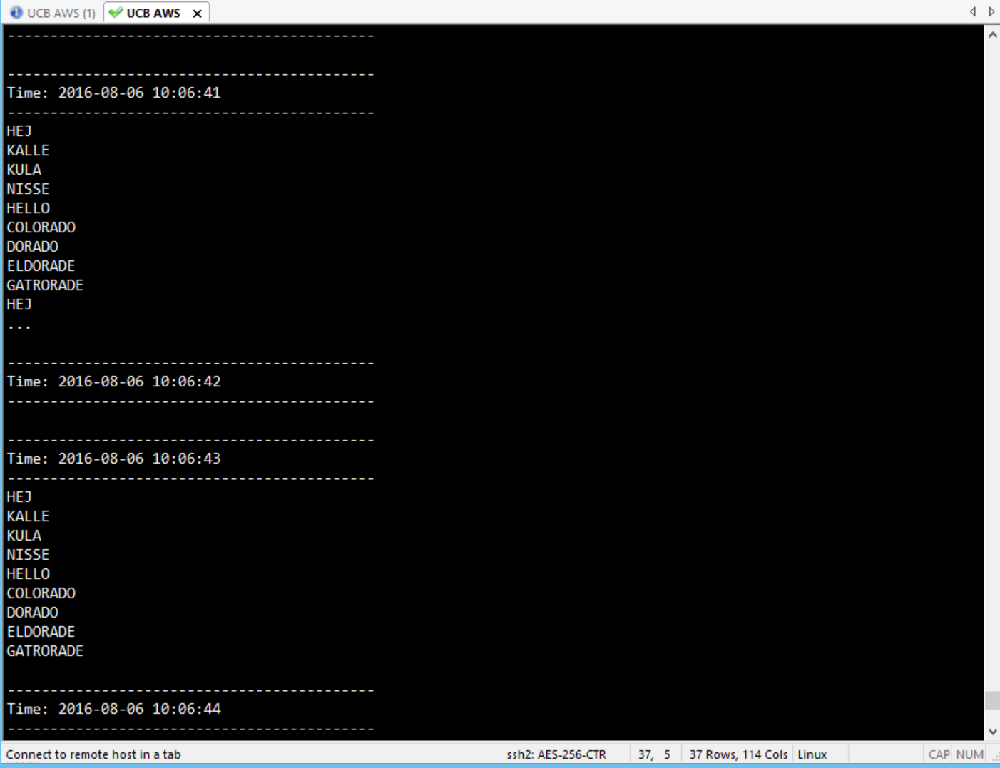
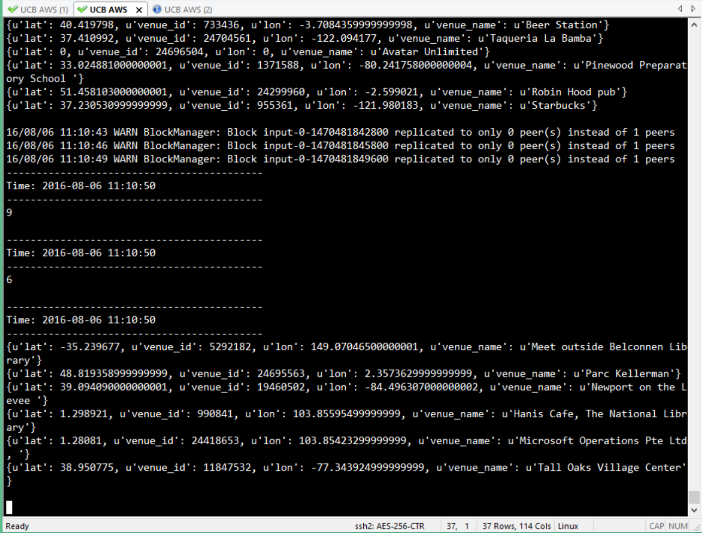

### 1.  Provide a screenshot of the output from the Spark Streaming process.



### 2: Change the code so that you save the venue components to a text file. Submit you code

```{python}
from pyspark import SparkContext
from pyspark.streaming import StreamingContext
import json

ssc = StreamingContext(sc, 10)
lines = ssc.textFileStream("file:////root/lab_10/datastream")
slines = lines.flatMap(lambda x: [ j['venue'] for j in json.loads('['+x+']') if 'venue' in j] )
cnt=slines.count()
cnt.pprint()
slines.pprint()
slines.saveAsTextFiles("file:////root/lab_10/venue_log")
ssc.start()
```


```
>>> ssc.start()
>>> -------------------------------------------
Time: 2016-08-06 15:15:10
-------------------------------------------

-------------------------------------------
Time: 2016-08-06 15:15:10
-------------------------------------------

16/08/06 15:15:11 WARN DomainSocketFactory: The short-circuit local reads feature cannot be used because libhadoop cannot be loaded.
-------------------------------------------
Time: 2016-08-06 15:15:20
-------------------------------------------
165

-------------------------------------------
Time: 2016-08-06 15:15:20
-------------------------------------------
{u'lat': 37.790005, u'venue_id': 21741962, u'lon': -122.397354, u'venue_name': u'Couchbase San Francisco'}
{u'lat': 1.300357, u'venue_id': 17525192, u'lon': 103.839043, u'venue_name': u'Food Republic at Level 5'}
{u'lat': -28.001623, u'venue_id': 1087923, u'lon': 153.416496, u'venue_name': u'Gold Coast Art Centre'}
{u'lat': 46.807144, u'venue_id': 24186719, u'lon': -71.238655, u'venue_name': u'Kalimera'}
{u'lat': 42.622475, u'venue_id': 5728532, u'lon': -71.361862, u'venue_name': u'Panera Bread'}
{u'lat': 45.515067, u'venue_id': 899456, u'lon': -122.678453, u'venue_name': u'Portland City Hall'}
{u'lat': 47.65704, u'venue_id': 19107532, u'lon': -122.344719, u'venue_name': u'Little Heart Space'}
{u'lat': 33.048553, u'venue_id': 4448112, u'lon': -96.82901, u'venue_name': u'Cinemark West Plano and XD'}
{u'lat': 33.216774, u'venue_id': 23939042, u'lon': -117.218994, u'venue_name': u'First Lutheran Church'}
{u'lat': -28.001623, u'venue_id': 1087923, u'lon': 153.416496, u'venue_name': u'Gold Coast Art Centre'}
...

-------------------------------------------
Time: 2016-08-06 15:15:30
-------------------------------------------
169

-------------------------------------------
Time: 2016-08-06 15:15:30
-------------------------------------------
{u'lat': 0, u'venue_id': 23814581, u'lon': 0, u'venue_name': u'Golden Mile Bowling'}
{u'lat': 36.169121, u'venue_id': 23875465, u'lon': -115.13961, u'venue_name': u'Co-Operate on Fremont'}
{u'lat': 38.921752, u'venue_id': 1140210, u'lon': -77.035037, u'venue_name': u'Sri Sri Center for Peace and Meditation'}
{u'lat': 49.243789, u'venue_id': 749483, u'lon': -122.892633, u'venue_name': u'Best Western Coquitlam Inn Convention Centre'}
{u'lat': 47.611515, u'venue_id': 24067329, u'lon': -122.345413, u'venue_name': u'Tune'}
{u'lat': 28.664251, u'venue_id': 23759123, u'lon': -81.39109, u'venue_name': u'Turkish Bar & Grill'}
{u'lat': 40.653358, u'venue_id': 1499088, u'lon': -73.512436, u'venue_name': u'Wantagh Park'}
{u'lat': 41.892548, u'venue_id': 1037115, u'lon': -88.105433, u'venue_name': u'Red Apple Pancake House'}
{u'lat': 45.486562, u'venue_id': 4282692, u'lon': -122.805689, u'venue_name': u'Sage Center'}
{u'lat': 47.611515, u'venue_id': 24067329, u'lon': -122.345413, u'venue_name': u'Tune'}
...

-------------------------------------------
Time: 2016-08-06 15:15:40
-------------------------------------------
157

-------------------------------------------
Time: 2016-08-06 15:15:40
-------------------------------------------
{u'lat': 34.116024, u'venue_id': 23995059, u'lon': -117.71907, u'venue_name': u'Rancho San Antonio Botanic Gardens'}
{u'lat': 1.300357, u'venue_id': 17525192, u'lon': 103.839043, u'venue_name': u'Food Republic at Level 5'}
{u'lat': 40.745945, u'venue_id': 14584482, u'lon': -74.25901, u'venue_name': u'South Mountain Yoga'}
{u'lat': 44.045547, u'venue_id': 13430212, u'lon': -123.102142, u'venue_name': u'Mcnail-Riley House'}
{u'lat': 43.734634, u'venue_id': 24080529, u'lon': -79.282501, u'venue_name': u'Epic Sports Badminton Club'}
{u'lat': 33.380379, u'venue_id': 17796852, u'lon': -111.666183, u'venue_name': u'The Hub '}
{u'lat': 47.795555, u'venue_id': 1169299, u'lon': -122.114365, u'venue_name': u'Crystal Creek Farms'}
{u'lat': 48.466053, u'venue_id': 1610756, u'lon': -123.410461, u'venue_name': u'Marigold park'}
{u'lat': 40.756901, u'venue_id': 22427342, u'lon': -73.990028, u'venue_name': u'Microsoft'}
{u'lat': 39.52055, u'venue_id': 9327552, u'lon': -104.907898, u'venue_name': u'1198 Finn Ave'}
...

-------------------------------------------
Time: 2016-08-06 15:15:50
-------------------------------------------
333

-------------------------------------------
Time: 2016-08-06 15:15:50
-------------------------------------------
{u'lat': 33.68428, u'venue_id': 21945532, u'lon': -112.08313, u'venue_name': u'Deer Valley Airport'}
{u'lat': 38.011219, u'venue_id': 23990499, u'lon': -84.456261, u'venue_name': u'Crust'}
{u'lat': 34.071278, u'venue_id': 16448342, u'lon': -118.384445, u'venue_name': u'300 N Clark Dr'}
{u'lat': 0, u'venue_id': 22645732, u'lon': 0, u'venue_name': u'North Seattle '}
{u'lat': 32.753937, u'venue_id': 1401046, u'lon': -97.332909, u'venue_name': u'Taverna'}
{u'lat': -31.976837, u'venue_id': 6752812, u'lon': 115.862259, u'venue_name': u'Sir James Mitchell Park - South Perth '}
{u'lat': 42.064476, u'venue_id': 24178164, u'lon': -88.148582, u'venue_name': u'CDK Global'}
{u'lat': 34.071278, u'venue_id': 16448342, u'lon': -118.384445, u'venue_name': u'300 N Clark Dr'}
{u'lat': 47.680763, u'venue_id': 7687192, u'lon': -122.404548, u'venue_name': u'Shilshole Bay Marina'}
{u'lat': 33.68428, u'venue_id': 21945532, u'lon': -112.08313, u'venue_name': u'Deer Valley Airport'}
...

-------------------------------------------
Time: 2016-08-06 15:16:00
-------------------------------------------

-------------------------------------------
Time: 2016-08-06 15:16:00
-------------------------------------------

-------------------------------------------
Time: 2016-08-06 15:16:10
-------------------------------------------
134

-------------------------------------------
Time: 2016-08-06 15:16:10
-------------------------------------------
{u'lat': 34.074036, u'venue_id': 11488612, u'lon': -84.311569, u'venue_name': u'Club 201 (American Legion Post 201'}
{u'lat': 45.531334, u'venue_id': 4964842, u'lon': -122.56319, u'venue_name': u'Gateway Transit Center 99th avenue, first floor'}
{u'lat': 30.404694, u'venue_id': 24118888, u'lon': -97.721611, u'venue_name': u'11800 Domain Blvd'}
{u'lat': 48.490093, u'venue_id': 24163940, u'lon': -123.402901, u'venue_name': u'Grohovac installations (near)'}
{u'lat': 38.063103, u'venue_id': 15225362, u'lon': -91.229057, u'venue_name': u'Onondaga Cave State Park'}
{u'lat': 42.156448, u'venue_id': 14084722, u'lon': -74.137016, u'venue_name': u'Roaring Kill Parking Area'}
{u'lat': 42.353497, u'venue_id': 20598212, u'lon': -71.059151, u'venue_name': u'Good Life'}
{u'lat': 35.226253, u'venue_id': 1543691, u'lon': -80.844313, u'venue_name': u'Skookum'}
{u'lat': 40.739993, u'venue_id': 736094, u'lon': -84.106984, u'venue_name': u'The Meeting Place'}
{u'lat': 33.581291, u'venue_id': 16666822, u'lon': -111.79158, u'venue_name': u'Fraesfield Mountain Trailhead'}
...

-------------------------------------------
Time: 2016-08-06 15:16:20
-------------------------------------------

-------------------------------------------
Time: 2016-08-06 15:16:20
-------------------------------------------

```


```{bash}
[root@ip-172-31-25-241 lab_10]# ls -l
total 1648
drwxr-xr-x 2 root root    4096 Aug  6 15:16 datastream
-rw-r--r-- 1 root root 1637595 Aug  6 10:49 meetup.data
drwxr-xr-x 2 root root    4096 Aug  6 15:14 somedata
drwxr-xr-x 2 root root    4096 Aug  6 15:15 venue_log-1470496510000
drwxr-xr-x 2 root root    4096 Aug  6 15:15 venue_log-1470496520000
drwxr-xr-x 2 root root    4096 Aug  6 15:15 venue_log-1470496530000
drwxr-xr-x 2 root root    4096 Aug  6 15:15 venue_log-1470496540000
drwxr-xr-x 2 root root    4096 Aug  6 15:15 venue_log-1470496550000
drwxr-xr-x 2 root root    4096 Aug  6 15:16 venue_log-1470496560000
drwxr-xr-x 2 root root    4096 Aug  6 15:16 venue_log-1470496570000
drwxr-xr-x 2 root root    4096 Aug  6 15:16 venue_log-1470496580000
-rw-r--r-- 1 root root      62 Aug  6 10:04 words.txt
[root@ip-172-31-25-241 lab_10]# ls -lR venue_log-*        
venue_log-1470496510000:
total 0
-rw-r--r-- 1 root root 0 Aug  6 15:15 _SUCCESS

venue_log-1470496520000:
total 20
-rw-r--r-- 1 root root     0 Aug  6 15:15 _SUCCESS
-rw-r--r-- 1 root root 17130 Aug  6 15:15 part-00000

venue_log-1470496530000:
total 20
-rw-r--r-- 1 root root     0 Aug  6 15:15 _SUCCESS
-rw-r--r-- 1 root root 17791 Aug  6 15:15 part-00000

venue_log-1470496540000:
total 20
-rw-r--r-- 1 root root     0 Aug  6 15:15 _SUCCESS
-rw-r--r-- 1 root root 16529 Aug  6 15:15 part-00000

venue_log-1470496550000:
total 40
-rw-r--r-- 1 root root     0 Aug  6 15:15 _SUCCESS
-rw-r--r-- 1 root root 18027 Aug  6 15:15 part-00000
-rw-r--r-- 1 root root 17052 Aug  6 15:15 part-00001

venue_log-1470496560000:
total 0
-rw-r--r-- 1 root root 0 Aug  6 15:16 _SUCCESS

venue_log-1470496570000:
total 16
-rw-r--r-- 1 root root     0 Aug  6 15:16 _SUCCESS
-rw-r--r-- 1 root root 13736 Aug  6 15:16 part-00000

venue_log-1470496580000:
total 0
-rw-r--r-- 1 root root 0 Aug  6 15:16 _SUCCESS
[root@ip-172-31-25-241 lab_10]# head ./venue_log-1470496520000/part-00000 
{u'lat': 37.790005, u'venue_id': 21741962, u'lon': -122.397354, u'venue_name': u'Couchbase San Francisco'}
{u'lat': 1.300357, u'venue_id': 17525192, u'lon': 103.839043, u'venue_name': u'Food Republic at Level 5'}
{u'lat': -28.001623, u'venue_id': 1087923, u'lon': 153.416496, u'venue_name': u'Gold Coast Art Centre'}
{u'lat': 46.807144, u'venue_id': 24186719, u'lon': -71.238655, u'venue_name': u'Kalimera'}
{u'lat': 42.622475, u'venue_id': 5728532, u'lon': -71.361862, u'venue_name': u'Panera Bread'}
{u'lat': 45.515067, u'venue_id': 899456, u'lon': -122.678453, u'venue_name': u'Portland City Hall'}
{u'lat': 47.65704, u'venue_id': 19107532, u'lon': -122.344719, u'venue_name': u'Little Heart Space'}
{u'lat': 33.048553, u'venue_id': 4448112, u'lon': -96.82901, u'venue_name': u'Cinemark West Plano and XD'}
{u'lat': 33.216774, u'venue_id': 23939042, u'lon': -117.218994, u'venue_name': u'First Lutheran Church'}
{u'lat': -28.001623, u'venue_id': 1087923, u'lon': 153.416496, u'venue_name': u'Gold Coast Art Centre'}
```

### 3: Provide a screenshot showing the running Spark Streaming application



### 4a: Provide a screenshot of the running Spark Streaming application that shows that the CountByWindow indeed provides an sum of the counts from the 3 latest batches. See example screenshot below


*I use the log instead*

```
-------------------------------------------
Time: 2016-08-06 11:24:50
-------------------------------------------
46

-------------------------------------------
Time: 2016-08-06 11:24:50
-------------------------------------------
14

-------------------------------------------
Time: 2016-08-06 11:24:50
-------------------------------------------
12

-------------------------------------------
Time: 2016-08-06 11:24:50
-------------------------------------------
{u'lat': 33.492311000000001, u'venue_id': 1294004, u'lon': -84.558589999999995, u'venue_name': u'Partners II Pizza'}
{u'lat': 53.564399999999999, u'venue_id': 24550762, u'lon': 9.9202700000000004, u'venue_name': u'jimdo Haus'}
{u'lat': 46.773902999999997, u'venue_id': 24369037, u'lon': 23.599454999999999, u'venue_name': u'ClujHub'}
{u'lat': 26.317739, u'venue_id': 9168942, u'lon': -80.157982000000004, u'venue_name': u'Panera Bread'}
{u'lat': 29.742263999999999, u'venue_id': 24199587, u'lon': -95.377135999999993, u'venue_name': u'HCC Conference Center'}
{u'lat': 35.855732000000003, u'venue_id': 24686226, u'lon': -78.669753999999998, u'venue_name': u'Elks Lodge Ballroom'}
{u'lat': 39.729343, u'venue_id': 16145292, u'lon': -75.561667999999997, u'venue_name': u"Timothy's on the Wilmington Riverfront (Shipyard Shops"}
{u'lat': 41.399245999999998, u'venue_id': 11787332, u'lon': 2.1612930000000001, u'venue_name': u'Dioclub'}
{u'lat': 40.894813999999997, u'venue_id': 10712892, u'lon': -73.098906999999997, u'venue_name': u'Espana Tapas and Wine Bar'}
{u'lat': 12.942117, u'venue_id': 24247141, u'lon': 77.575362999999996, u'venue_name': u'Fralk - 3rd floor , Aishwarya sampoorna '}
...

16/08/06 11:24:51 WARN BlockManager: Block input-0-1470482691400 replicated to only 0 peer(s) instead of 1 peers
16/08/06 11:24:53 WARN BlockManager: Block input-0-1470482693000 replicated to only 0 peer(s) instead of 1 peers
-------------------------------------------
Time: 2016-08-06 11:25:00
-------------------------------------------
32

-------------------------------------------
Time: 2016-08-06 11:25:00
-------------------------------------------
6

-------------------------------------------
Time: 2016-08-06 11:25:00
-------------------------------------------
5

-------------------------------------------
Time: 2016-08-06 11:25:00
-------------------------------------------
{u'lat': 39.170921, u'venue_id': 24270593, u'lon': -77.262611000000007, u'venue_name': u'Pack Place K9'}
{u'lat': 40.800097999999998, u'venue_id': 744924, u'lon': -74.481605999999999, u'venue_name': u'Pazzo Pazzo'}
{u'lat': 45.101913000000003, u'venue_id': 24504546, u'lon': -93.441299000000001, u'venue_name': u'Maple Grove Public Library, Training Room 133'}
{u'lat': 41.438094999999997, u'venue_id': 24695838, u'lon': -71.452881000000005, u'venue_name': u'Narragansett Beach south lot'}
{u'lat': 35.227085000000002, u'venue_id': 24591436, u'lon': -80.843124000000003, u'venue_name': u'Frog Song Farm'}

16/08/06 11:25:01 WARN BlockManager: Block input-0-1470482701200 replicated to only 0 peer(s) instead of 1 peers
16/08/06 11:25:02 WARN BlockManager: Block input-0-1470482702000 replicated to only 0 peer(s) instead of 1 peers
16/08/06 11:25:04 WARN BlockManager: Block input-0-1470482704400 replicated to only 0 peer(s) instead of 1 peers
16/08/06 11:25:08 WARN BlockManager: Block input-0-1470482707800 replicated to only 0 peer(s) instead of 1 peers
16/08/06 11:25:10 WARN BlockManager: Block input-0-1470482709800 replicated to only 0 peer(s) instead of 1 peers
-------------------------------------------
Time: 2016-08-06 11:25:10
-------------------------------------------
31

-------------------------------------------
Time: 2016-08-06 11:25:10
-------------------------------------------
11

-------------------------------------------
Time: 2016-08-06 11:25:10
-------------------------------------------
8

-------------------------------------------
Time: 2016-08-06 11:25:10
-------------------------------------------
{u'lat': 12.942117, u'venue_id': 24247141, u'lon': 77.575362999999996, u'venue_name': u'Fralk - 3rd floor , Aishwarya sampoorna '}
{u'lat': 0, u'venue_id': 23896302, u'lon': 0, u'venue_name': u'AMC Joe Dodge Lodge at Pinkham Notch'}
{u'lat': 41.399245999999998, u'venue_id': 11787332, u'lon': 2.1612930000000001, u'venue_name': u'Dioclub'}
{u'lat': 40.419894999999997, u'venue_id': 22424542, u'lon': -3.6891050000000001, u'venue_name': u'Parque del Retiro, Puerta de la Independencia (Puerta de Alcal\xe1)'}
{u'lat': 44.544960000000003, u'venue_id': 1971671, u'lon': -72.527379999999994, u'venue_name': u'Elmore State Park '}
{u'lat': 35.171658000000001, u'venue_id': 24303615, u'lon': -80.879326000000006, u'venue_name': u'Three Spirits Brewery'}
{u'lat': 43.653182999999999, u'venue_id': 9959682, u'lon': -116.25588999999999, u'venue_name': u'The Drink'}
{u'lat': -26.389091000000001, u'venue_id': 24646184, u'lon': 153.092285, u'venue_name': u'Halse lodge '}

16/08/06 11:25:14 WARN BlockManager: Block input-0-1470482714000 replicated to only 0 peer(s) instead of 1 peers
16/08/06 11:25:17 WARN BlockManager: Block input-0-1470482717200 replicated to only 0 peer(s) instead of 1 peers
-------------------------------------------
Time: 2016-08-06 11:25:20
-------------------------------------------
26

-------------------------------------------
Time: 2016-08-06 11:25:20
-------------------------------------------
9

16/08/06 11:25:20 WARN BlockManager: Block input-0-1470482720600 replicated to only 0 peer(s) instead of 1 peers
-------------------------------------------
Time: 2016-08-06 11:25:20
-------------------------------------------
8

-------------------------------------------
Time: 2016-08-06 11:25:20
-------------------------------------------
{u'lat': 40.419894999999997, u'venue_id': 22424542, u'lon': -3.6891050000000001, u'venue_name': u'Parque del Retiro, Puerta de la Independencia (Puerta de Alcal\xe1)'}
{u'lat': 35.709026000000001, u'venue_id': 24260160, u'lon': 139.73199500000001, u'venue_name': u'Hub Ikebukuro East Annex'}
{u'lat': 0, u'venue_id': 24640953, u'lon': 0, u'venue_name': u'Starbucks'}
{u'lat': 38.863742999999999, u'venue_id': 369626, u'lon': -77.379850000000005, u'venue_name': u'SRA Volleyball Courts'}
{u'lat': 51.444893, u'venue_id': 4984702, u'lon': -0.20629500000000001, u'venue_name': u'Wimbledon Park Tennis Courts'}
{u'lat': -26.389091000000001, u'venue_id': 24646184, u'lon': 153.092285, u'venue_name': u'Halse lodge '}
{u'lat': 40.316524999999999, u'venue_id': 24383294, u'lon': -74.845000999999996, u'venue_name': u'40.29764, -74.86834 '}
{u'lat': 41.075321000000002, u'venue_id': 24697898, u'lon': -75.434325999999999, u'venue_name': u'Pocono Raceway'}

16/08/06 11:25:24 WARN BlockManager: Block input-0-1470482724200 replicated to only 0 peer(s) instead of 1 peers
16/08/06 11:25:28 WARN BlockManager: Block input-0-1470482728200 replicated to only 0 peer(s) instead of 1 peers
16/08/06 11:25:29 WARN BlockManager: Block input-0-1470482729600 replicated to only 0 peer(s) instead of 1 peers
-------------------------------------------
Time: 2016-08-06 11:25:30
-------------------------------------------
31

-------------------------------------------
Time: 2016-08-06 11:25:30
-------------------------------------------
11

-------------------------------------------
Time: 2016-08-06 11:25:30
-------------------------------------------
9

-------------------------------------------
Time: 2016-08-06 11:25:30
-------------------------------------------
{u'lat': 39.006774999999998, u'venue_id': 24702528, u'lon': -76.779137000000006, u'venue_name': u"Kamise's House!"}
{u'lat': 51.506850999999997, u'venue_id': 3500822, u'lon': -0.142927, u'venue_name': u'Green Park'}
{u'lat': 47.886372000000001, u'venue_id': 24695607, u'lon': 8.9075299999999995, u'venue_name': u'Sufi Zentrum Rabbaniyya - Der Wahre Mensch e.V.'}
{u'lat': 51.506850999999997, u'venue_id': 3500822, u'lon': -0.142927, u'venue_name': u'Green Park'}
{u'lat': 40.511406000000001, u'venue_id': 24659054, u'lon': -74.661086999999995, u'venue_name': u'iconic.yoga@gmail.com'}
{u'lat': 47.886372000000001, u'venue_id': 24695607, u'lon': 8.9075299999999995, u'venue_name': u'Sufi Zentrum Rabbaniyya - Der Wahre Mensch e.V.'}
{u'lat': 42.495086999999998, u'venue_id': 3342822, u'lon': -71.123649999999998, u'venue_name': u"Sal's Pizza"}
{u'lat': 1.249404, u'venue_id': 9623922, u'lon': 103.830322, u'venue_name': u'Palawan Beach, Sentosa Island'}
{u'lat': 1.30088, u'venue_id': 23904219, u'lon': 103.87416, u'venue_name': u'Sports Hub @ OCBC Arena - Hall 3'}
```
### 4b: Also explain what the difference is between having 10 sec batches with a 30 sec sliding window and a 30 second batch length.

> In 30 second batch length, the sliding window will only count the current batch data.  
> In 10 second batch length, the sliding window will count the current plus last 2 batches.   