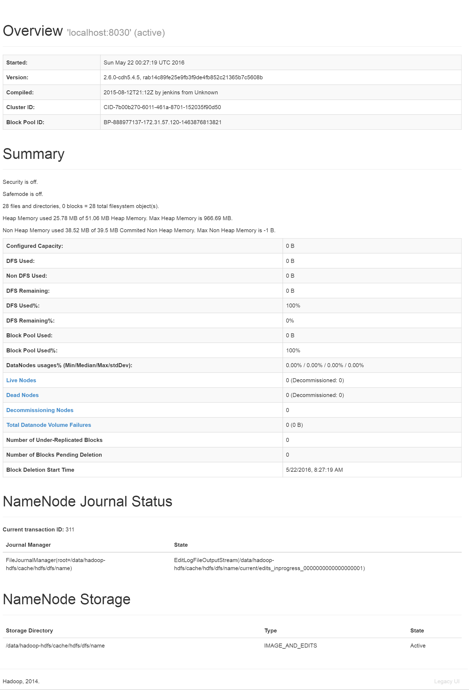

## 1 - List the HDFS contents of /user
```bash
[root@ip-172-31-57-120 ~]# sudo netstat -tulpn 
Active Internet connections (only servers)
Proto Recv-Q Send-Q Local Address               Foreign Address             State       PID/Program name   
tcp        0      0 127.0.0.1:19888             0.0.0.0:*                   LISTEN      5695/java           
tcp        0      0 0.0.0.0:10033               0.0.0.0:*                   LISTEN      5695/java           
tcp        0      0 0.0.0.0:50070               0.0.0.0:*                   LISTEN      3360/java           
tcp        0      0 0.0.0.0:22                  0.0.0.0:*                   LISTEN      871/sshd            
tcp        0      0 0.0.0.0:5432                0.0.0.0:*                   LISTEN      5823/postgres       
tcp        0      0 0.0.0.0:13562               0.0.0.0:*                   LISTEN      5479/java           
tcp        0      0 0.0.0.0:44733               0.0.0.0:*                   LISTEN      5479/java           
tcp        0      0 127.0.0.1:8030              0.0.0.0:*                   LISTEN      3360/java           
tcp        0      0 127.0.0.1:10020             0.0.0.0:*                   LISTEN      5695/java           
tcp        0      0 0.0.0.0:8040                0.0.0.0:*                   LISTEN      5479/java           
tcp        0      0 0.0.0.0:8042                0.0.0.0:*                   LISTEN      5479/java           
tcp        0      0 0.0.0.0:50090               0.0.0.0:*                   LISTEN      3539/java           
tcp        0      0 :::5432                     :::*                        LISTEN      5823/postgres       
udp        0      0 0.0.0.0:68                  0.0.0.0:*                               700/dhclient        
udp        0      0 172.31.57.120:123           0.0.0.0:*                               880/ntpd            
udp        0      0 127.0.0.1:123               0.0.0.0:*                               880/ntpd            
udp        0      0 0.0.0.0:123                 0.0.0.0:*                               880/ntpd            
udp        0      0 :::123                      :::*                                    880/ntpd            
[root@ip-172-31-57-120 ~]# hdfs dfs -ls /user
Found 7 items
drwxr-xr-x   - mapred  supergroup          0 2016-05-22 00:29 /user/history
drwxrwxrwx   - hive    supergroup          0 2016-05-22 00:30 /user/hive
drwxrwxrwx   - hue     supergroup          0 2016-05-22 00:30 /user/hue
drwxrwxrwx   - jenkins supergroup          0 2016-05-22 00:29 /user/jenkins
drwxr-xr-x   - hdfs    supergroup          0 2016-05-22 00:30 /user/oozie
drwxrwxrwx   - root    supergroup          0 2016-05-22 00:30 /user/root
drwxr-xr-x   - w205    supergroup          0 2016-05-22 00:31 /user/w205
```

## 2 - Inspect the output of the HDFS admin report and answer the following questions in a text file.  To generate this, exit from the w205 user and type:
```bash
[root@ip-172-31-57-120 ~]# ^C
[root@ip-172-31-57-120 ~]# sudo -u hdfs hdfs dfsadmin -report -live -dead -decommissioning
Configured Capacity: 0 (0 B)
Present Capacity: 0 (0 B)
DFS Remaining: 0 (0 B)
DFS Used: 0 (0 B)
DFS Used%: NaN%
Under replicated blocks: 0
Blocks with corrupt replicas: 0
Missing blocks: 0
Missing blocks (with replication factor 1): 0

-------------------------------------------------
Live datanodes (0):

Dead datanodes (0):

Decommissioning datanodes (0):
```



### Q1: How many live datanodes are there?
> Live datanodes is 0

### Q2: How much non-DFS storage is used?
> non-DFS storage: 0 B

### Q3: How much DFS storage is used?
> DFS Used: 0 B