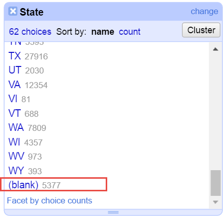
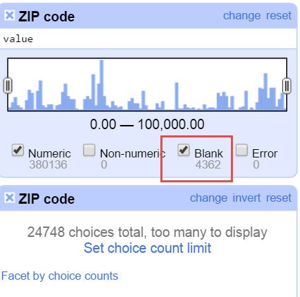
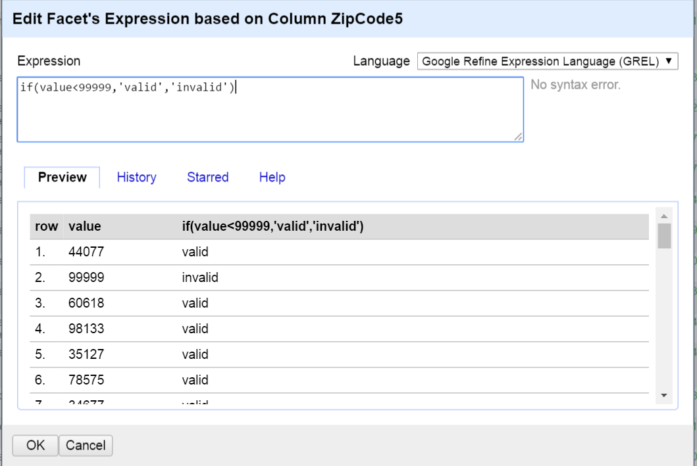
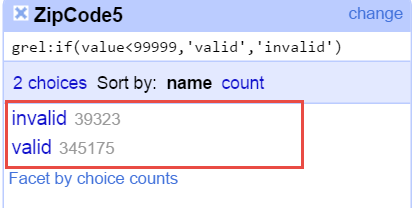
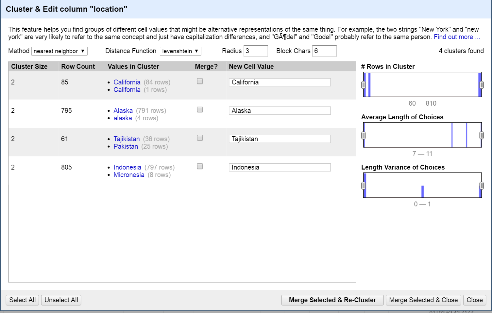
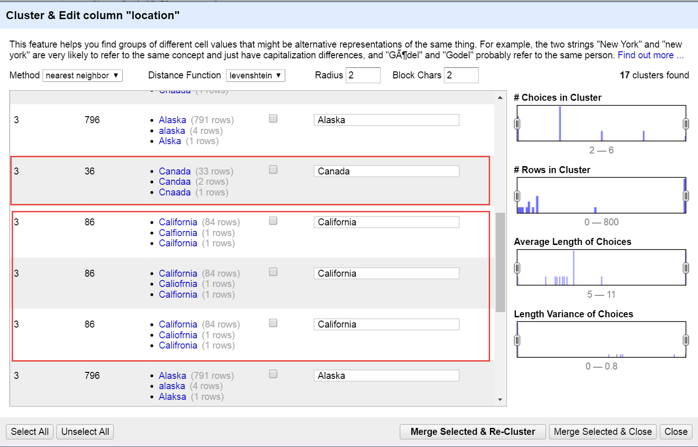
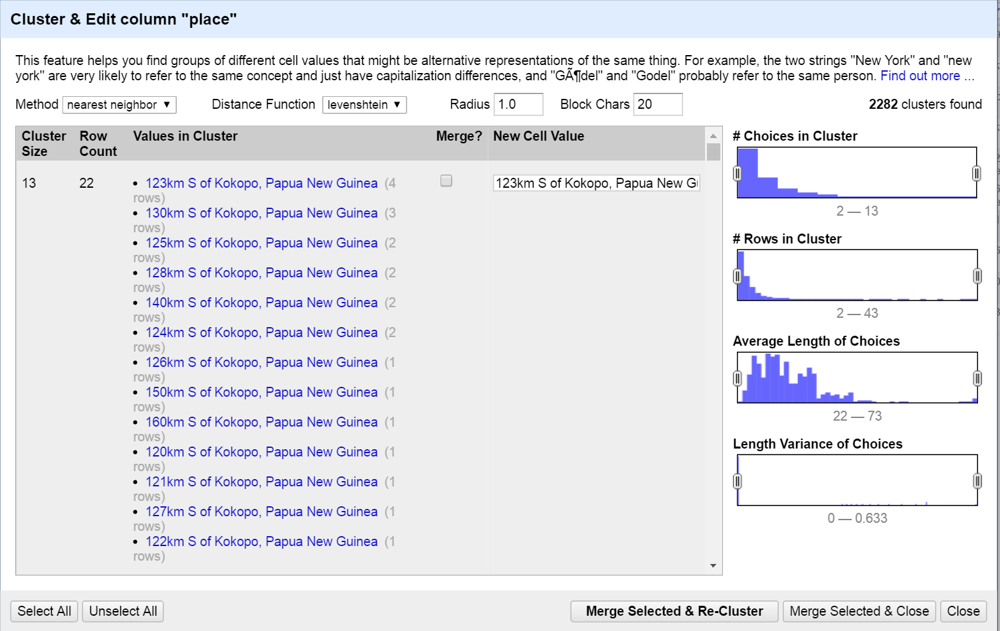
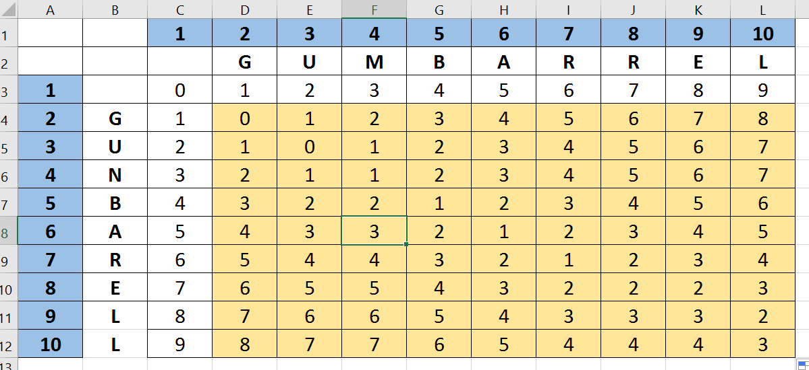

### 1) How many rows are missing a value in the “State” column? Explain how you came up with the number.



### 2) How many rows with missing ZIP codes do you have?



### 3) If you consider all ZIP codes less than 99999 valid ZIP codes, how many valid and invalid ZIP codes do you have, respectively?




### 5) Change the radius to 3.0. What happens? Do you want to merge any of the resulting matches?



### 6) Change the block size to 2. Give two examples of new clusters that may be worthwhile merging.



### 7) Explain in words what happens when you cluster the “place” column, and why you think that happened. What additional functionality could OpenRefine provide to possibly deal with the situation?

>  1) Given n strings, there are n(n-1)/2 pairs of strings (and relative distances) that need to be compared and this turns out to be too slow even for small datasets.  
2) Using "blocking" in the nearest-neighbor clustering could speed up the calculation




### 8) Submit a representation of the resulting matrix from the Leveshtein edit distance calculation. The resulting value should be correct



```{python}
>>> distance("gunbarell","gumbarrel")
3
```