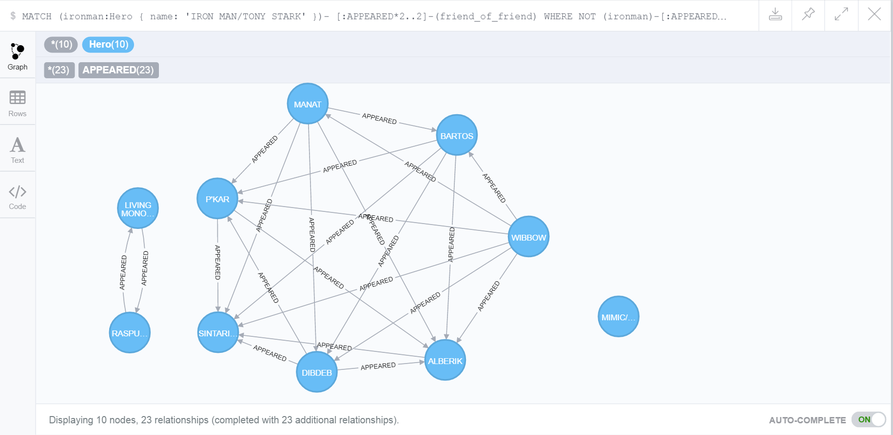
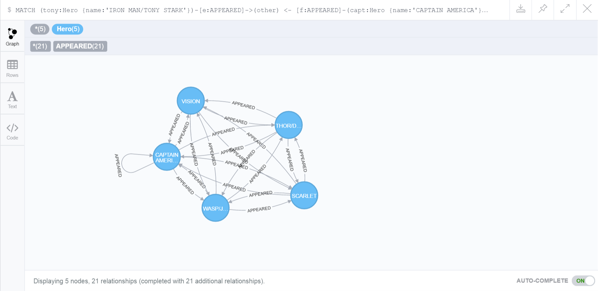
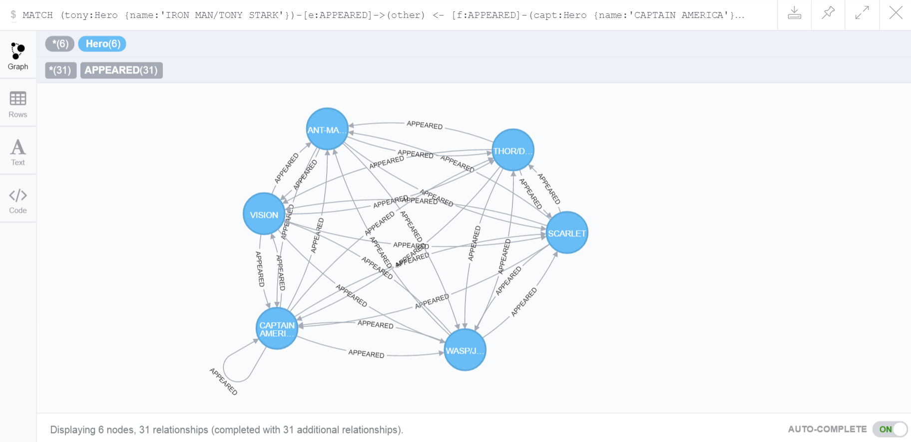
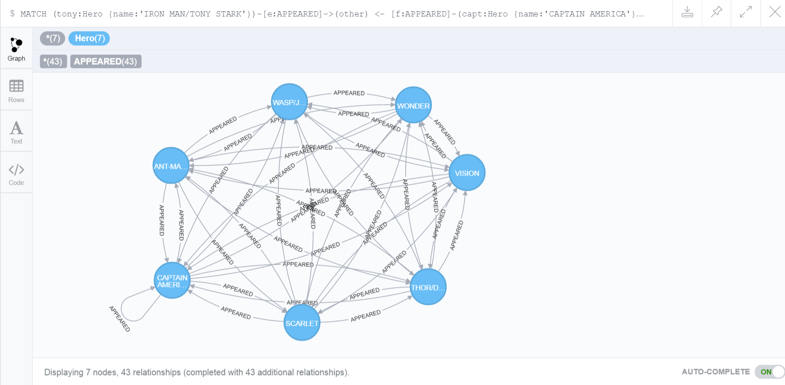
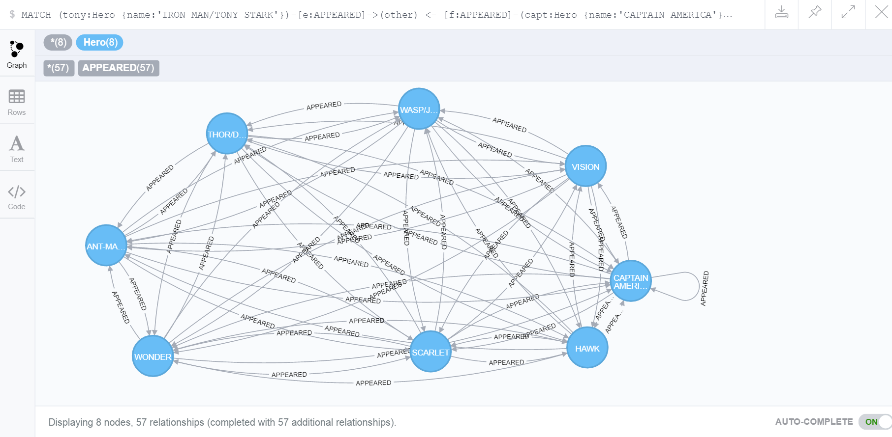
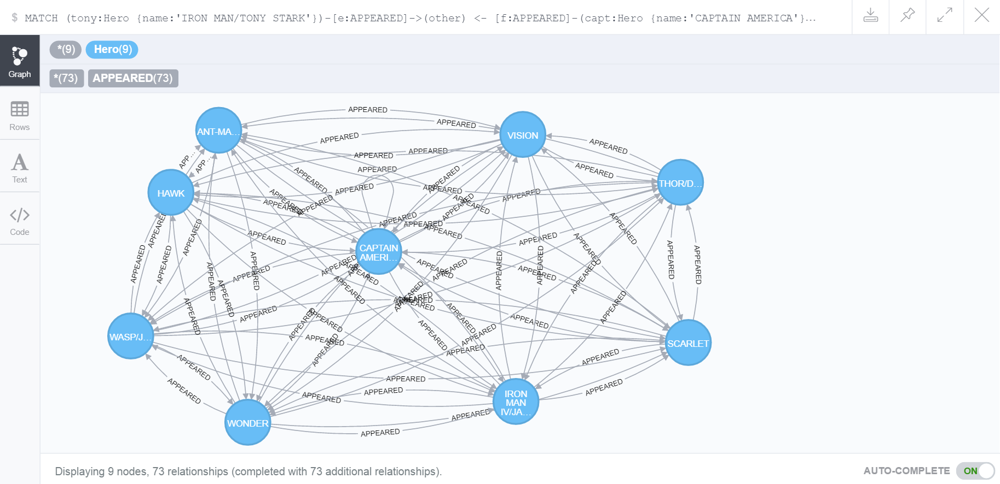
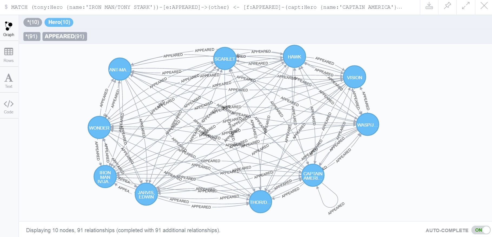

### 1.  What is the shortest path between DR. STRANGE and DR. DOOM?

```
MATCH (DrStange:Hero)
WHERE DrStange.name STARTS WITH "DR. STRANGE"
RETURN DrStange
```

```
MATCH (DrDoom:Hero)
WHERE DrDoom.name STARTS WITH "DR. DOOM"
RETURN DrDoom
```

```
MATCH p=(DrDoom:Hero {name: 'DR. DOOM/VICTOR VON'})-[:APPEARED*0..2]-(DrStange:Hero {name: 'DR. STRANGE/STEPHEN'})
RETURN p, length(p)
ORDER BY length(p)
LIMIT 1
```

```
╒══════════════════════════════╤═════════╕
│p                             │length(p)│
╞══════════════════════════════╪═════════╡
│[{name: DR. DOOM/VICTOR VON, d│1        │
│egree: 441}, {w: 8}, {name: DR│         │
│. STRANGE/STEPHEN, degree: 777│         │
│}]                            │         │
└──────────────────────────────┴─────────┘
```

### 2. List the 5 shortest paths between DR. STRANGE and DR. DOOM

```
MATCH p=(DrDoom:Hero {name: 'DR. DOOM/VICTOR VON'})-[:APPEARED*0..2]-(DrStange:Hero {name: 'DR. STRANGE/STEPHEN'})
RETURN p, length(p)
ORDER BY length(p)
LIMIT 5
```


```
╒══════════════════════════════╤═════════╕
│p                             │length(p)│
╞══════════════════════════════╪═════════╡
│[{name: DR. DOOM/VICTOR VON, d│1        │
│egree: 441}, {w: 8}, {name: DR│         │
│. STRANGE/STEPHEN, degree: 777│         │
│}]                            │         │
├──────────────────────────────┼─────────┤
│[{name: DR. DOOM/VICTOR VON, d│1        │
│egree: 441}, {w: 12}, {name: D│         │
│R. STRANGE/STEPHEN, degree: 77│         │
│7}]                           │         │
├──────────────────────────────┼─────────┤
│[{name: DR. DOOM/VICTOR VON, d│2        │
│egree: 441}, {w: 2}, {name: CA│         │
│PTAIN BRITAIN/BRIA, degree: 32│         │
│7}, {w: 3}, {name: DR. STRANGE│         │
│/STEPHEN, degree: 777}]       │         │
├──────────────────────────────┼─────────┤
│[{name: DR. DOOM/VICTOR VON, d│2        │
│egree: 441}, {w: 1}, {name: CA│         │
│PTAIN BRITAIN/BRIA, degree: 32│         │
│7}, {w: 3}, {name: DR. STRANGE│         │
│/STEPHEN, degree: 777}]       │         │
├──────────────────────────────┼─────────┤
│[{name: DR. DOOM/VICTOR VON, d│2        │
│egree: 441}, {w: 1}, {name: RE│         │
│DWING, degree: 175}, {w: 1}, {│         │
│name: DR. STRANGE/STEPHEN, deg│         │
│ree: 777}]                    │         │
└──────────────────────────────┴─────────┘
```


### 3. List 5 Friends of Friends with the most connections and COLOSSUS II.

```
MATCH (col:Hero) WHERE col.name STARTS WITH "COLOSSUS II" RETURN col
```

```
╒══════════════════════════════╕
│col                           │
╞══════════════════════════════╡
│{name: COLOSSUS II DOPPELGA, d│
│egree: 118}                   │
├──────────────────────────────┤
│{name: COLOSSUS II/PETER RA, d│
│egree: 760}                   │
├──────────────────────────────┤
│{name: COLOSSUS II | MUTANT, d│
│egree: 18}                    │
└──────────────────────────────┘
```

```
MATCH (col:Hero { name: 'COLOSSUS II/PETER RA' })-
[:APPEARED*2..2]-(friend_of_friend)
WHERE NOT (col)-[:APPEARED]-(friend_of_friend)
AND friend_of_friend.name <> 'COLOSSUS II/PETER RA'
RETURN friend_of_friend.name, COUNT(*)
ORDER BY COUNT(*) DESC , friend_of_friend.name
LIMIT 5
```

```
╒═════════════════════╤════════╕
│friend_of_friend.name│COUNT(*)│
╞═════════════════════╪════════╡
│WONG                 │453     │
├─────────────────────┼────────┤
│MOONSTONE II/KARLA S │370     │
├─────────────────────┼────────┤
│CARTER, PEGGY        │367     │
├─────────────────────┼────────┤
│POWER MAN/ERIK JOSTE │350     │
├─────────────────────┼────────┤
│KINGPIN/WILSON FISK  │342     │
└─────────────────────┴────────┘
```

### 4. Visualize 10 Friends of friends for IRON MAN

```
MATCH (ironman:Hero)
WHERE ironman.name STARTS WITH "IRON MAN"
RETURN ironman
```

```
MATCH (ironman:Hero { name: 'IRON MAN/TONY STARK' })-
[:APPEARED*2..2]-(friend_of_friend)
WHERE NOT (ironman)-[:APPEARED]-(friend_of_friend)
AND friend_of_friend.name <> 'IRON MAN/TONY STARK'
RETURN friend_of_friend
LIMIT 10
```

```
╒══════════════════════════════╕
│friend_of_friend              │
╞══════════════════════════════╡
│{name: BARTOS, degree: 16}    │
├──────────────────────────────┤
│{name: MIMIC/CALVIN RANKIN, de│
│gree: 89}                     │
├──────────────────────────────┤
│{name: MANAT, degree: 17}     │
├──────────────────────────────┤
│{name: SINTARIIS, degree: 5}  │
├──────────────────────────────┤
│{name: DIBDEB, degree: 15}    │
├──────────────────────────────┤
│{name: RASPUTIN, MIKHAIL, degr│
│ee: 54}                       │
├──────────────────────────────┤
│{name: WIBBOW, degree: 20}    │
├──────────────────────────────┤
│{name: P'KAR, degree: 14}     │
├──────────────────────────────┤
│{name: LIVING MONOLITH/AHME, d│
│egree: 61}                    │
├──────────────────────────────┤
│{name: ALBERIK, degree: 8}    │
└──────────────────────────────┘
```



### 5. Discover how the Avengers grew over time from 5 to 10. Find team members starting with 5 and incrementing to 10. Who was added to the team? Is the resulting graph ever not fully connected?

The core members of Avengers started with Iron Man and Captain America.

```
MATCH (tony:Hero {name:'IRON MAN/TONY STARK'})-[e:APPEARED]->(other) <- [f:APPEARED]-(capt:Hero {name:'CAPTAIN AMERICA'})
RETURN other
ORDER BY e.w DESC, f.w DESC
LIMIT 5
```

#### 5 Teammates
```
╒══════════════════════════════╕
│other                         │
╞══════════════════════════════╡
│{name: CAPTAIN AMERICA, degree│
│: 1426}                       │
├──────────────────────────────┤
│{name: SCARLET WITCH/WANDA, de│
│gree: 1004}                   │
├──────────────────────────────┤
│{name: THOR/DR. DONALD BLAK, d│
│egree: 947}                   │
├──────────────────────────────┤
│{name: VISION, degree: 919}   │
├──────────────────────────────┤
│{name: WASP/JANET VAN DYNE, de│
│gree: 778}                    │
└──────────────────────────────┘
```



#### 6 Teammates, ANT-MAN joined the team
```
╒══════════════════════════════╕
│other                         │
╞══════════════════════════════╡
│{name: CAPTAIN AMERICA, degree│
│: 1426}                       │
├──────────────────────────────┤
│{name: SCARLET WITCH/WANDA, de│
│gree: 1004}                   │
├──────────────────────────────┤
│{name: THOR/DR. DONALD BLAK, d│
│egree: 947}                   │
├──────────────────────────────┤
│{name: VISION, degree: 919}   │
├──────────────────────────────┤
│{name: WASP/JANET VAN DYNE, de│
│gree: 778}                    │
├──────────────────────────────┤
│{name: ANT-MAN/DR. HENRY J., d│
│egree: 775}                   │
└──────────────────────────────┘
```


#### 7 Teammates, WONDER MAN joined the team
```
╒══════════════════════════════╕
│other                         │
╞══════════════════════════════╡
│{name: CAPTAIN AMERICA, degree│
│: 1426}                       │
├──────────────────────────────┤
│{name: SCARLET WITCH/WANDA, de│
│gree: 1004}                   │
├──────────────────────────────┤
│{name: THOR/DR. DONALD BLAK, d│
│egree: 947}                   │
├──────────────────────────────┤
│{name: VISION, degree: 919}   │
├──────────────────────────────┤
│{name: WASP/JANET VAN DYNE, de│
│gree: 778}                    │
├──────────────────────────────┤
│{name: ANT-MAN/DR. HENRY J., d│
│egree: 775}                   │
├──────────────────────────────┤
│{name: WONDER MAN/SIMON WIL, d│
│egree: 729}                   │
└──────────────────────────────┘
```


#### 8 Teammates, HAWK joined the team
```
╒══════════════════════════════╕
│other                         │
╞══════════════════════════════╡
│{name: CAPTAIN AMERICA, degree│
│: 1426}                       │
├──────────────────────────────┤
│{name: SCARLET WITCH/WANDA, de│
│gree: 1004}                   │
├──────────────────────────────┤
│{name: THOR/DR. DONALD BLAK, d│
│egree: 947}                   │
├──────────────────────────────┤
│{name: VISION, degree: 919}   │
├──────────────────────────────┤
│{name: WASP/JANET VAN DYNE, de│
│gree: 778}                    │
├──────────────────────────────┤
│{name: ANT-MAN/DR. HENRY J., d│
│egree: 775}                   │
├──────────────────────────────┤
│{name: WONDER MAN/SIMON WIL, d│
│egree: 729}                   │
├──────────────────────────────┤
│{name: HAWK, degree: 880}     │
└──────────────────────────────┘
```


#### 9 Teammates, IRON MAN IV joined the team
```
╒══════════════════════════════╕
│other                         │
╞══════════════════════════════╡
│{name: CAPTAIN AMERICA, degree│
│: 1426}                       │
├──────────────────────────────┤
│{name: SCARLET WITCH/WANDA, de│
│gree: 1004}                   │
├──────────────────────────────┤
│{name: THOR/DR. DONALD BLAK, d│
│egree: 947}                   │
├──────────────────────────────┤
│{name: VISION, degree: 919}   │
├──────────────────────────────┤
│{name: WASP/JANET VAN DYNE, de│
│gree: 778}                    │
├──────────────────────────────┤
│{name: ANT-MAN/DR. HENRY J., d│
│egree: 775}                   │
├──────────────────────────────┤
│{name: WONDER MAN/SIMON WIL, d│
│egree: 729}                   │
├──────────────────────────────┤
│{name: HAWK, degree: 880}     │
├──────────────────────────────┤
│{name: IRON MAN IV/JAMES R., d│
│egree: 338}                   │
└──────────────────────────────┘
```


#### 10 Teammates, JAVIS joined the team
```
╒══════════════════════════════╕
│other                         │
╞══════════════════════════════╡
│{name: CAPTAIN AMERICA, degree│
│: 1426}                       │
├──────────────────────────────┤
│{name: SCARLET WITCH/WANDA, de│
│gree: 1004}                   │
├──────────────────────────────┤
│{name: THOR/DR. DONALD BLAK, d│
│egree: 947}                   │
├──────────────────────────────┤
│{name: VISION, degree: 919}   │
├──────────────────────────────┤
│{name: WASP/JANET VAN DYNE, de│
│gree: 778}                    │
├──────────────────────────────┤
│{name: ANT-MAN/DR. HENRY J., d│
│egree: 775}                   │
├──────────────────────────────┤
│{name: WONDER MAN/SIMON WIL, d│
│egree: 729}                   │
├──────────────────────────────┤
│{name: HAWK, degree: 880}     │
├──────────────────────────────┤
│{name: IRON MAN IV/JAMES R., d│
│egree: 338}                   │
├──────────────────────────────┤
│{name: JARVIS, EDWIN, degree: │
│707}                          │
└──────────────────────────────┘
```


> The result graphs are always fully connected